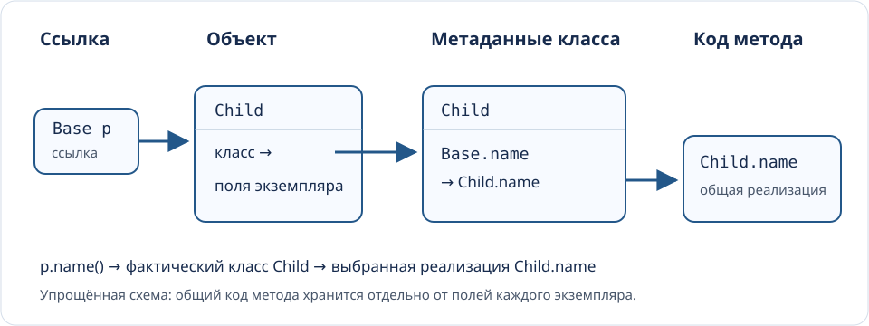

<!-- Единый Markdown-исходник. Основа первой части: Lec3-new, слайды 50–71.
     План второй части: Java master c2b2b65c99e368ff49de0e09adec80056e429d92.
     Техническая база: Java SE 25 без preview, C++20; история датирована отдельно. -->

## Маршрут лекции 4 {#sec-lectures-development}

**Классы:** выбор метода, подготовка состояния, блоки инициализации и современные формы классов.

**Обобщение:** параметры типов, контракты операций, коллекции и один алгоритм над числами и матрицами.

Сопоставим Java с C++, затем выясним, что изменило позднее добавление generics и какой путь выбрала C#.

::: {.notes}
Первая часть продолжает Lec3-new с 50-го слайда: в архиве это блок связывания, затем история форм классов. Исходные слайды 50–71 сохранены в том же порядке, между блоками добавлен разбор инициализации. Термины и устройство слайдов сохранены: короткие заголовки, небольшие фрагменты, сравнительные таблицы, объяснение и источники в заметках. Во второй части материал следует текущему плану generics/collections. История C# содержит ранний дизайн CLR и явно отмеченное современное уточнение C#11/.NET7. Слайды не требуют preview Java. Примеры и определения операций находятся в слайдах и заметках; намеренно ошибочные строки отмечены. Длительность зависит от объёма разбора примеров: углубления в early-construction, bridges, generic math и некоммутирующие коэффициенты можно оставить в заметках.
:::


## Как выбирается метод {#block-binding .section-title}

Статический тип определяет допустимый вызов. Фактический класс объекта может определять его реализацию.

::: {.notes}
На этом различии держится подстановка реализаций. Термин связывание используют и для загрузки библиотек, и для выбора метода. В этом блоке сначала говорим о выборе вызываемой реализации, затем покажем связь с JVM. Статическое связывание означает, что выбор не зависит от фактического класса получателя во время выполнения.
:::

## Статический тип и выбор метода {#dispatch}

```java
class Base {
    int x = 1;
    String name() { return "Base"; }
}
class Child extends Base {
    int x = 2;
    @Override String name() { return "Child"; }
}
Base p = new Child();
```

`p.x` равно `1`, а `p.name()` возвращает `"Child"`.

::: {.notes}
Объект Child содержит оба поля: Base.x и Child.x. Поле выбирается по статическому типу выражения p. Переопределяемый name выбирается по фактическому классу объекта. Такой результат не требует специального ключевого слова virtual в Java. @Override просит компилятор проверить, что метод действительно переопределяет унаследованное объявление. Аннотация сама не включает динамический вызов.
Источник: [JLS, доступ к полю и вызов метода](https://docs.oracle.com/javase/specs/jls/se25/html/jls-15.html#jls-15.11).
:::

## C++ явно выделяет виртуальные функции {#cpp-binding}

```cpp
struct Base {
    const char* plain() const { return "Base"; }
    virtual const char* name() const { return "Base"; }
    virtual ~Base() = default;
};
struct Child : Base {
    const char* plain() const { return "Child"; }
    const char* name() const override { return "Child"; }
};
Child child;
Base& p = child;
```

`p.plain()` вернёт `"Base"`, `p.name()` — `"Child"`.

::: {.notes}
Невиртуальная функция выбирается по статическому типу Base, виртуальная — по фактическому объекту Child. Важно передать ссылку или указатель на исходный объект. Запись Base p = child создала бы отдельный Base и срезала производную часть: это другая операция. override полезен для проверки намерения и в C++. Виртуальный деструктор нужен для корректного обычного delete через указатель на Base при фактическом Child; здесь он показан как часть пригодной к такому использованию базы.
Источник: [C++ virtual functions](https://eel.is/c++draft/class.virtual).
:::

## Перегрузка выбирается до переопределения {#overload-override}

```java
class Printer {
    String show(Object x) { return "Object"; }
    String show(String x) { return "String"; }
}
class Fancy extends Printer {
    @Override String show(Object x) { return "Fancy:Object"; }
}
Printer p = new Fancy();
Object x = "Java";
System.out.println(p.show(x)); // Fancy:Object
```

Компилятор выбрал `show(Object)`. Во время работы выбрана его реализация в `Fancy`.

::: {.notes}
У фактического x строковое значение, но статический тип выражения x — Object. Поэтому перегрузка show(String) не участвует как выбранная сигнатура. После этого динамический вызов ищет переопределение именно show(Object). В C++ разрешение перегрузки тоже выполняется статически, а затем virtual при необходимости выбирает конечное переопределение. Такой пример точнее общего утверждения «все методы Java выбираются динамически».
Источник: [JLS, выбор метода](https://docs.oracle.com/javase/specs/jls/se25/html/jls-15.html#jls-15.12).
:::

## Где участвует динамический выбор {#binding-rules}

| Конструкция | Java | C++ |
|---|---|---|
| Обычный метод экземпляра | Переопределяемый по умолчанию | Динамический выбор при `virtual` |
| `static` | Принадлежит классу | Принадлежит классу |
| `private` в Java | Не переопределяется | Доступ и виртуальность — отдельные свойства |
| `final` у метода | Запрещает переопределение | Запрещает дальнейшее переопределение виртуальной функции |
| Поле | Выбор по статическому типу | Выбор по статическому типу |

::: {.notes}
У C++ private virtual-функция может быть переопределена: доступ и выбор final overrider не совпадают. В Java static-метод производного класса скрывает одноимённый static-метод базы, поэтому его лучше вызывать через имя класса. Вызов super.method() в Java и явно квалифицированный Base::method() в C++ задают реализацию базы. final не обязывает JVM использовать какой-то один opcode или гарантированно встраивать вызов. Это прежде всего ограничение допустимых программ.
Источники: [JLS, overriding and hiding](https://docs.oracle.com/javase/specs/jls/se25/html/jls-8.html#jls-8.4.8), [C++ virtual functions](https://eel.is/c++draft/class.virtual).
:::

## Реализация динамического вызова {#binding-runtime}



JVM использует `invokevirtual` и `invokeinterface` для обычных вызовов с динамическим выбором. JIT может заменить их прямым вызовом или встроенным кодом.

::: {.notes}
Упрощённая схема показывает связь объект — класс — реализация метода. HotSpot применяет таблицы методов и кэши вызовов; C++ ABI часто использует vptr и vtable. Обе реализации сохраняют семантику динамического выбора. Если JIT выяснил единственный подходящий класс, он может специализировать код, сохранив проверки и возможность отменить предположение. Динамическое связывание символических ссылок class-файла при загрузке и выборе классов — отдельный этап; оно не тождественно выбору переопределения для конкретного получателя. Код инструкции вызова указывает объявление. Фактический класс помогает выбрать реализацию.
Источники: [JVMS, resolution и method selection](https://docs.oracle.com/javase/specs/jvms/se25/html/jvms-5.html#jvms-5.4.6), [Itanium ABI, virtual tables](https://itanium-cxx-abi.github.io/cxx-abi/abi.html#vtable).
:::

## Вызов из конструктора требует внимания {#constructor-dispatch}

В Java переопределяемый метод из конструктора базы может попасть в код подкласса, поля которого ещё не прошли обычную инициализацию.

В C++ виртуальный вызов при конструировании действует в пределах той части иерархии, которая сейчас строится.

Конструктор удобно строить из операций, для которых уже выполнены необходимые условия.

::: {.notes}
Это полезный практический итог сравнения. В Java сначала существуют значения по умолчанию полей всего объекта. Во время конструктора Base обычный виртуальный вызов способен войти в Child и увидеть ещё не инициализированные обычными инициализаторами поля. В Java 25 ограниченный пролог конструктора может менять доступную последовательность действий; общий риск раннего вызова переопределяемого поведения сохраняется. В C++ вызов во время конструктора Base не выбирает переопределение Child. Из этого не следует, что любой вызов метода в конструкторе ошибочен: важно знать, какие данные и инварианты доступны в этот момент.
Источники: [JLS, инициализация экземпляра](https://docs.oracle.com/javase/specs/jls/se25/html/jls-12.html#jls-12.5), [C++ construction and destruction](https://eel.is/c++draft/class.cdtor).
:::


## Создание объекта и инициализация класса {#block-initialization .section-title}

У класса есть общее состояние. У каждого экземпляра есть собственное состояние.

Порядок их подготовки определяет, какие данные уже доступны конструктору и вызываемым методам.

::: {.notes}
Этот блок развивает последний вопрос о раннем виртуальном вызове. Различаем инициализацию класса, инициализацию полей экземпляра и работу конструктора. В Java есть отдельный синтаксис для каждой из этих задач. Далее сначала используем обычные конструкторы без пролога, затем явно уточним изменение Java 25.
:::

## Поле, блок и конструктор {#init-three-forms}

```java
class Ticket {
    static int next = 1;
    static { System.out.println("static"); }
    final int id = next++;
    { System.out.println("instance " + id); }
    Ticket() {
        this("guest");
        System.out.println("body()");
    }
    Ticket(String who) {
        System.out.println("body(" + who + ")");
    }
}
```

`static {}` готовит состояние класса. Блок `{}` участвует в подготовке каждого экземпляра.

::: {.notes}
В фигурных скобках после static находится static initializer. Блок без static, непосредственно в теле класса, называется instance initializer. Его не следует путать с телом метода или вложенным блоком в конструкторе. Значение id получается из общей последовательности next. Это однопоточный учебный пример, а не потокобезопасный генератор идентификаторов. Параметры who относятся к конкретному конструктору и недоступны блоку экземпляра.
Источник: [JLS 25, §8.6–8.8](https://docs.oracle.com/javase/specs/jls/se25/html/jls-8.html#jls-8.6).
:::

## Делегирование сохраняет один экземпляр {#init-this-once}

```java
new Ticket();
new Ticket("staff");
```

```text
static
instance 1
body(guest)
body()
instance 2
body(staff)
```

`this("guest")` вызывает другой конструктор **того же объекта**. Поля и блоки экземпляра при этом не повторяются.

::: {.notes}
Предложите сначала предсказать вывод. Для первого объекта целевой конструктор завершает свою работу, затем выполняется остаток делегирующего конструктора. Во втором new снова выполняются instance initializers, но static-блок повторно не запускается. Конструкторы удобно сводить к одному основному через this(...), чтобы проверка параметров и установка инварианта не расходились. Циклическое делегирование запрещено.
Источник: [JLS 25, §12.5](https://docs.oracle.com/javase/specs/jls/se25/html/jls-12.html#jls-12.5).
:::

## Загрузка и инициализация — разные этапы {#init-class-lifecycle}

| Этап JVM | Основная работа |
|---|---|
| Загрузка | Найти представление класса и создать его `Class` |
| Связывание | Проверить код, подготовить хранение и разрешать ссылки |
| Инициализация | Выполнить инициализаторы статических полей и `static`-блоки |

Класс может быть загружен, хотя его `static`-блоки ещё не выполнялись.

::: {.notes}
При preparation static-поля получают значения по умолчанию. Выполнение пользовательских инициализаторов относится к initialization. Разрешение символических ссылок может происходить заранее или по мере необходимости, поэтому таблица показывает логические задачи, а не единственный жёсткий момент для каждой ссылки. Класс во время работы определяется двоичным именем и определившим его загрузчиком: два загрузчика могут создать разные runtime-классы с одним именем. Фраза «один раз» относится к одному такому классу.
Источники: [JLS, §12.2–12.4](https://docs.oracle.com/javase/specs/jls/se25/html/jls-12.html), [JVMS, §5.3–5.5](https://docs.oracle.com/javase/specs/jvms/se25/html/jvms-5.html).
:::

## Первое активное использование запускает инициализацию {#init-active-use}

```java
class Limits {
    static final int FIXED = 7;
    static final int CALCULATED = calculate();
    static { System.out.println("init"); }
    static int calculate() { return 8; }
}
```

Чтение `Limits.FIXED` само по себе не запускает этот код. Чтение `Limits.CALCULATED` запускает.

`new Limits()`, вызов объявленного здесь `static`-метода и запись в `static`-поле также требуют инициализации класса.

::: {.notes}
FIXED — constant variable: final, примитивный тип и constant expression. final Integer FIXED = 7 и final int CALCULATED = calculate() этим условиям не отвечают. Тип в объявлении переменной, Limits.class и new Limits[3] сами по себе не запускают initialization Limits. Определённые операции reflection тоже являются триггерами. Обращение Child.inheritedField требует инициализации типа, который объявил поле, а не обязательно Child. Здесь не перечисляем все низкоуровневые случаи MethodHandle.
Источник: [JLS, §12.4.1](https://docs.oracle.com/javase/specs/jls/se25/html/jls-12.html#jls-12.4.1).
:::

## Порядок задаётся устройством класса {#init-instance-order}

Для обычного конструктора без пролога:

1. Поля всего объекта получают значения по умолчанию.
2. Выполняется конструктор суперкласса.
3. Поля и блоки экземпляра данного класса инициализируются в порядке записи.
4. Выполняется оставшаяся часть тела конструктора.

```java
int x = 3;
{ x *= 2; }
int y = x + 1;    // после этой последовательности x = 6, y = 7
```

::: {.notes}
Этапы 2–4 повторяются для каждой ступени иерархии. Поэтому в обычном конструкторе Base переопределение Child ещё может увидеть нули и null в полях Child. Локальные переменные, в отличие от полей, не получают автоматически доступные значения: компилятор требует definite assignment. Статические поля с вычисляемыми инициализаторами и static-блоки данного класса также идут по порядку записи; сначала готовятся необходимые предки. Constant variables обрабатываются отдельно. Прямые недопустимые forward references компилятор отклоняет, однако косвенные циклы через методы ещё возможны.
Источники: [JLS, §12.4.2 и §12.5](https://docs.oracle.com/javase/specs/jls/se25/html/jls-12.html#jls-12.4.2), [начальные значения](https://docs.oracle.com/javase/specs/jls/se25/html/jls-4.html#jls-4.12.5).
:::

## Java 25 допускает действия перед `super(...)` {#init-java25-prologue}

```java
class Positive extends Base {
    final int value;
    Positive(int n) {
        if (n < 0) throw new IllegalArgumentException();
        this.value = n;
        super();
    }
}
```

Пролог позволяет проверить аргументы и ограниченно подготовить собственные поля. Читать состояние строящегося объекта или вызывать его методы здесь нельзя.

::: {.notes}
Это стабильная возможность Java 25, без --enable-preview. Поэтому правило «super()/this() обязательно первая инструкция» для современного языка уже неверно. Раннее простое присваивание допустимо собственному полю без инициализатора в объявлении. Полю int value = 1 так присвоить нельзя, как нельзя использовать += или ++, требующие чтения. Нельзя передать this наружу. Обычные instance initializers остаются после вызова конструктора базы. Если explicit constructor invocation отсутствует, неявный super() выполняется перед телом. Если база вызывает show(), раннее присваивание может сделать value доступным уже при этом вызове. Это иллюстрация порядка, а не рекомендация вызывать переопределяемые методы из конструктора.
Источники: [Oracle, Flexible Constructor Bodies](https://docs.oracle.com/en/java/javase/25/language/flexible-constructor-bodies.html), [JLS, §8.8.7](https://docs.oracle.com/javase/specs/jls/se25/html/jls-8.html#jls-8.8.7).
:::

## В C++ конструктор выбирает инициализаторы членов {#init-cpp-members}

```cpp
struct Ticket {
    int a = 3;
    int b = 4;
    Ticket() : Ticket(9) {}
    Ticket(int n) : b(n), a(1) {}
};
```

Сначала строится `a`, затем `b`: порядок задают объявления полей. Список `b(n), a(1)` его не меняет.

Инициализатор члена в конструкторе заменяет значение из объявления. Присваивание в теле происходит уже после инициализации.

::: {.notes}
У C++ сначала строятся виртуальные базы, затем непосредственные базы, затем поля в порядке объявления, затем выполняется тело. В данном примере default member initializers 3 и 4 не вычисляются. Делегирование Ticket():Ticket(9) выполняет целевой конструктор, затем тело делегирующего. Оно должно быть единственным mem-initializer. В стандартном описании порядок объявлений объясняется согласованием с обратным порядком разрушения. Скалярный член без подходящего инициализатора не получает универсального обещания нулевого значения, как поле Java. Компилятор может предупредить о переставленном initializer-list: порядок записи в списке не меняет порядок объявления полей.
Источник: [C++ draft, class.base.init](https://eel.is/c++draft/class.base.init).
:::

## Общие данные C++ можно готовить при первом обращении {#init-cpp-local-static}

```cpp
const Config& config() {
    static const Config value = loadConfig();
    return value;
}
```

Инициализация локального `static` завершается при первом проходе через его объявление. С C++11 другие потоки ожидают её завершения.

У статических объектов разных единиц трансляции общий порядок сложной инициализации может отсутствовать.

::: {.notes}
Сравниваем задачи, а не ищем побуквенный аналог Java static-блока. В C++ состояние задают статические переменные и их инициализаторы, helper-функции, локальный static и другие механизмы. Динамическая инициализация namespace-scope объектов может быть отложенной, поэтому «все глобальные конструкторы обязательно до main» слишком сильное правило. В одной обычной единице трансляции порядок определений существенен, для шаблонов, inline-переменных и модулей есть дополнительные правила. Исключение при инициализации function-local static позволяет повторную попытку. Рекурсивный вход в ту же инициализацию в C++ имеет undefined behavior.
Источники: [C++ draft, stmt.dcl](https://eel.is/c++draft/stmt.dcl), [basic.start.dynamic](https://eel.is/c++draft/basic.start.dynamic).
:::

## Инициализация класса задаёт протокол среды исполнения {#init-java-design}

JVM может получать новые классы во время работы программы. Подготовку общего состояния она связывает с использованием конкретного класса.

Один поток выполняет инициализацию, остальные ждут. Успешно подготовленное состояние становится доступно использующему его коду.

`static`-блок позволяет выразить последовательность действий рядом с полями. Блок экземпляра выражает общую часть подготовки объектов.

::: {.notes}
Почему такое решение естественно для Java? Это преподавательское объяснение устройства: классовая единица загрузки получает собственную единицу подготовки состояния, а автору не нужно знать весь набор будущих классов при линковке одной исполняемой программы. Спецификация непосредственно обосновывает синхронизацию многопоточностью и требует согласованного первого наблюдаемого состояния. Она не доказывает, что именно эта аргументация была единственной исторической причиной выбора синтаксиса блоков. В C++ важны также объект как значение, прямое размещение членов и детерминированное разрушение, поэтому список инициализации решает дополнительные задачи. Блоки не заменяют конструкторы: для проверки параметров и явного выбора вариантов создания удобны конструктор, фабрика и this(...).
Источники: [JLS, §12.4](https://docs.oracle.com/javase/specs/jls/se25/html/jls-12.html#jls-12.4), [JVMS, §5](https://docs.oracle.com/javase/specs/jvms/se25/html/jvms-5.html).
:::

## Отказ инициализации затрагивает весь класс {#init-failure}

```java
class Settings {
    static int value = read();
    static int read() { throw new IllegalStateException(); }
}
```

Первое обращение к `Settings.value` получает `ExceptionInInitializerError`. Следующее обращение к тому же runtime-классу получает `NoClassDefFoundError`.

Короткая подготовка состояния подходит блоку. Работу, которую нужно повторять после отказа, удобнее запускать явно.

::: {.notes}
Здесь причина — исключение, не являющееся Error, поэтому JVM оборачивает его в ExceptionInInitializerError и помечает класс как erroneous. Уже загруженный класс существует, но его нельзя успешно инициализировать: NoClassDefFoundError не всегда означает отсутствующий файл. Повторная загрузка другим загрузчиком создаёт другую идентичность класса, однако это не обычный механизм восстановления. При рекурсивном запросе инициализации из того же потока Java разрешает продолжение, из-за чего циклические зависимости могут открыть значения по умолчанию. Синхронизация initialization не обеспечивает безопасность последующих изменений общего изменяемого списка.
Источник: [JLS, §12.4.2](https://docs.oracle.com/javase/specs/jls/se25/html/jls-12.html#jls-12.4.2).
:::


## Как развивались формы классов {#block-class-history .section-title}

Устройство класса постепенно дополнялось средствами локализации кода, повторного использования алгоритмов и точного описания данных.

::: {.notes}
Историю полезно рассматривать после обычного класса и инварианта. Теперь у каждой новой конструкции будет понятная задача. Годы на слайдах относятся к окончательным выпускам без preview. Мы используем стабильные возможности Java SE 25; запись record стала окончательной в Java 16, sealed — в 17, pattern switch — в 21. Это учебная линия развития идей: разные парадигмы продолжают сосуществовать в одной программе.
:::

## У класса несколько независимых характеристик {#class-dimensions}

| Вопрос | Варианты |
|---|---|
| Как объявлен тип? | Обычный `class`, `enum`, `record` |
| Где он объявлен? | Верхний уровень, член класса, локально, анонимно |
| Как его расширяют? | Открытый, `final`, `sealed`, `non-sealed` |
| Можно ли создать экземпляр? | Конкретный или `abstract` |
| Параметризован ли тип? | Например, `Box<T>` |

`private static final class Box<T>` одновременно сочетает несколько характеристик.

::: {.notes}
Название вида зависит от выбранной оси. Вложенный класс может быть generic и final; abstract-класс может быть sealed. Поэтому плоский список «всех типов классов» быстро начинает смешивать разные свойства. Видимость public, protected, private и пакетный доступ задают ещё одну ось с ограничениями по месту объявления. В данном примере Box объявлен членом другого класса. Интерфейс и annotation interface — отдельные виды объявлений типов. Слова DTO, entity и service описывают роль класса в приложении.
Источники: [JLS 25, виды объявлений классов](https://docs.oracle.com/javase/specs/jls/se25/html/jls-8.html#jls-8.1), [JLS, интерфейсы](https://docs.oracle.com/javase/specs/jls/se25/html/jls-9.html).
:::

## От объектных иерархий к моделированию данных {#class-timeline}

| Выпуск | Средства | Задача |
|---|---|---|
| 1.0 · 1996 | Классы, интерфейсы, `abstract`, `final` | Инкапсуляция и полиморфизм |
| 1.1 · 1997 | Вложенные, локальные, анонимные классы | Локальное поведение, обработчики событий |
| 5 · 2004 | Generics, `enum`, аннотации | Типобезопасные библиотеки и метаданные |
| 8 · 2014 | Лямбды, методы интерфейсов с реализацией | Передача поведения и развитие API |
| 16–21 · 2021–2023 | `record`, `sealed`, pattern matching | Данные и исчерпывающий разбор вариантов |
| 25 · 2025 | Компактные исходные файлы | Постепенное знакомство с языком |

::: {.notes}
Первая строка отражает исходную классовую модель Java. Вложенные классы пришли с JDK 1.1 и удобно выражали небольшие обработчики в объектном API событий. Java 5 усилила статическую типизацию библиотек и декларативные метаданные. Java 8 сделала передачу поведения компактной. В группе 16–21 указаны отдельные шаги: record — 16, sealed — 17, record patterns и pattern switch — 21. Компактные файлы Java 25 убирают часть синтаксиса вокруг небольшой программы, сохраняя классовую модель выполнения.
Источники: [Oracle, Java 5 и 8](https://docs.oracle.com/javase/8/docs/technotes/guides/language/enhancements.html), [архив спецификации с Inner Classes 1.1](https://docs.oracle.com/javase/specs/jvms/se6/html/Concepts.doc.html), [JDK 17, перечень JEP и выпусков](https://openjdk.org/projects/jdk/17/jeps-since-jdk-11), [JLS 25, implicit classes](https://docs.oracle.com/javase/specs/jls/se25/html/jls-8.html#jls-8.1.8).
:::

## Обычный, абстрактный и `final` {#ordinary-abstract-final}

```java
abstract class Shape {
    abstract double area();
}
final class Square extends Shape {
    private final double side;
    Square(double side) { this.side = side; }
    @Override double area() { return side * side; }
}
```

`Shape` задаёт общую операцию. `Square` предоставляет реализацию и закрывает дальнейшее наследование.

::: {.notes}
Эти средства относятся к исходной объектной модели Java. У abstract-класса могут быть поля, конструкторы и полностью реализованные методы. Непосредственно создать new Shape нельзя, но конструктор базы работает при создании подкласса. final class запрещает подклассы; final field запрещает повторное присваивание поля. Обе записи final сами по себе не доказывают глубокую неизменяемость. Пример площади иллюстрирует форму класса, поэтому полный предметный контракт положительной конечной стороны здесь не задан.
Источник: [JLS, модификаторы класса](https://docs.oracle.com/javase/specs/jls/se25/html/jls-8.html#jls-8.1.1).
:::

## Вложенный `static`-класс группирует понятия {#nested-static}

```java
class Catalog {
    static final class Entry {
        final String title;
        Entry(String title) { this.title = title; }
    }
}
Catalog.Entry e = new Catalog.Entry("Java");
```

Тип `Entry` расположен рядом с использующим его `Catalog`. Для создания `Entry` экземпляр `Catalog` не требуется.

::: {.notes}
Это member class, то есть класс-член. Он имеет собственные экземпляры и может содержать обычные поля; static относится к отсутствию обязательного внешнего экземпляра. Из вложенного типа доступны члены внешнего класса при наличии необходимого объекта и соблюдении правил языка. Группировка полезна для тесно связанных вспомогательных типов, например Builder или Entry. Имя class-файла часто содержит знак \$, но на его точный вид прикладной код полагаться не должен.
Источник: [Oracle, nested classes](https://docs.oracle.com/javase/tutorial/java/javaOO/nested.html).
:::

## Внутренний класс связан с внешним экземпляром {#inner-class}

```java
class Catalog {
    private int size = 3;
    class Cursor {
        int limit() { return size; }
    }
}
Catalog catalog = new Catalog();
Catalog.Cursor cursor = catalog.new Cursor();
```

`Cursor` использует состояние того `Catalog`, для которого создан.

::: {.notes}
Здесь inner class означает нестатический класс-член, связанный с enclosing instance. Это удобно для курсора или помощника, поведение которого естественно зависит от конкретного внешнего объекта. Реализация может хранить скрытую ссылку на Catalog. Если cursor живёт долго и использует внешний объект, такая связь продлевает достижимость Catalog. Для независимого вспомогательного типа обычно достаточно static nested class. Не следует объявлять, что любой вложенный класс обязательно содержит скрытую ссылку: static-класс её не требует, а компилятор может оптимизировать ненужные связи.
Источник: [JLS, inner classes and enclosing instances](https://docs.oracle.com/javase/specs/jls/se25/html/jls-8.html#jls-8.1.3).
:::

## Локальный и анонимный класс задают поведение рядом {#local-anonymous}

```java
int limit = 3;
class Check {                         // локальный класс
    boolean accepts(int n) { return n <= limit; }
}
Runnable task = new Runnable() {      // анонимный класс
    @Override public void run() {
        System.out.println(limit);
    }
};
```

Захватываемые локальные переменные должны быть `final` или effectively final.

::: {.notes}
Фрагмент находится внутри метода. Локальный класс имеет имя, область видимости которого ограничена блоком. Анонимный класс объявляется в выражении создания; собственного объявляемого конструктора у него нет. Такая форма с JDK 1.1 позволяла передавать обработчик в объектный API. В Java 8 стало достаточно effectively final: переменная не объявлена final явно, но её значение после инициализации не переназначают. Можно захватить ссылку на изменяемый объект; неизменность переменной не запрещает изменение этого объекта. Если захваченные данные переживают вызов, реализация сохраняет необходимое состояние в созданном объекте.
Источники: [Oracle, local classes](https://docs.oracle.com/javase/tutorial/java/javaOO/localclasses.html), [anonymous classes](https://docs.oracle.com/javase/tutorial/java/javaOO/anonymousclasses.html).
:::

## Java 5: `enum` задаёт именованные экземпляры {#enum-class}

```java
enum Status {
    AVAILABLE, RESERVED;
    boolean canReserve() { return this == AVAILABLE; }
}
```

У `enum` есть фиксированный набор констант своего типа, поля, методы и конструктор.

Число `7` невозможно случайно передать вместо `Status`. Список состояний читается из объявления типа.

::: {.notes}
До Java 5 часто применяли int-константы или вручную реализовывали typesafe enum pattern. Перечисление включило эту идею в язык. Enum расширяет java.lang.Enum и может реализовывать интерфейсы; пользовательский произвольный суперкласс указать нельзя. Создание экземпляров ограничено enum-константами. Когда константа имеет собственное тело, у неё может быть специальный подкласс, поэтому формулировка «любой enum всегда final» слишком груба. Обычный enum без таких тел не допускает пользовательских подклассов. Ссылочная переменная Status всё ещё может содержать null.
Источники: [Oracle, Java 5 enums](https://docs.oracle.com/javase/8/docs/technotes/guides/language/enhancements.html), [JLS, enum classes](https://docs.oracle.com/javase/specs/jls/se25/html/jls-8.html#jls-8.9).
:::

## Java 5: параметр типа усиливает общий код {#generic-class}

```java
class Box<T> {
    private final T value;
    Box(T value) { this.value = value; }
    T get() { return value; }
}
Box<String> box = new Box<>("Java");
String text = box.get();
```

Generics описывают связь между входом и результатом. Большая часть параметров типов стирается в представлении JVM.

::: {.notes}
Generic — дополнительная характеристика обычного класса, интерфейса или record. Java 5 развивала обобщённое программирование при сохранении совместимости существующих библиотек. Box<String> и Box<Integer> обычно используют один runtime-класс Box. Компилятор выполняет проверки и при необходимости вставляет приведения и bridge methods; некоторые generic-сигнатуры остаются в метаданных для reflection. В C++ шаблоны обычно создают специализированные варианты по параметрам, а ограничения можно выразить concepts. Сырые raw types сохраняются ради совместимости и ослабляют проверки.
Источники: [Oracle, erasure](https://docs.oracle.com/javase/tutorial/java/generics/erasure.html), [Java 5 generics и исследование GJ](https://docs.oracle.com/javase/8/docs/technotes/guides/language/enhancements.html).
:::

## Java 8: поведение удобно передать лямбдой {#lambda-history}

```java
Runnable task = () -> System.out.println("Готово");
java.util.function.Predicate<Integer> positive = n -> n > 0;
```

Лямбда получает тип функционального интерфейса с одной абстрактной операцией.

Она удобна для обработчика, условия, преобразования или шага конвейера.

::: {.notes}
Функциональный интерфейс может иметь default- и static-методы, но его функциональный контракт определяется одной абстрактной операцией с учётом правил наследования. @FunctionalInterface помогает проверить намерение. Лямбда не является объявлением анонимного класса: this сохраняет смысл внешнего контекста, а идентичность получаемого функционального объекта не предназначена для программных предположений. Захват локальных переменных подчиняется правилу effectively final. Анонимный класс остаётся полезным для дополнительного состояния, нескольких методов или наследования класса. Его формального запрета или общей deprecated-пометки нет.
Источники: [JLS, lambda expressions](https://docs.oracle.com/javase/specs/jls/se25/html/jls-15.html#jls-15.27), [Oracle, lambda expressions](https://docs.oracle.com/javase/tutorial/java/javaOO/lambdaexpressions.html).
:::

## Java 16: `record` объявляет данные значения {#record-class}

```java
record Point(int x, int y) {}
Point p = new Point(2, 3);
System.out.println(p.x());          // 2
System.out.println(p.equals(new Point(2, 3))); // true
```

Компоненты определяют поля, конструктор, методы доступа, `equals`, `hashCode` и `toString`.

Record-класс закрыт для наследования и может реализовывать интерфейсы.

::: {.notes}
Records прошли preview в Java 14 и 15, окончательно появились в 16, в 2021 году. Это развитие моделирования данных: объявление сообщает, из чего состоит значение, а стандартный код выводится из этого описания. Record расширяет java.lang.Record и далее Object. Присваивание переменной Point по-прежнему копирует ссылку. Нельзя добавить собственные дополнительные поля экземпляра за пределами компонентов; методы, static-члены и вложенные типы допустимы. Record подходит там, где открытое описание компонентов соответствует контракту.
Источники: [Oracle, record classes](https://docs.oracle.com/en/java/javase/25/language/records.html), [JDK 17, JEP 395 в выпуске 16](https://openjdk.org/projects/jdk/17/jeps-since-jdk-11).
:::

## `record` сохраняет обычные обязанности конструктора {#record-contract}

```java
record Group(java.util.List<String> names) {
    Group {
        names = java.util.List.copyOf(names);
    }
}
```

`final` фиксирует ссылки компонентов. Защитная копия задаёт независимую структуру списка.

Если компоненты содержат изменяемые объекты, их состояние требует отдельной политики.

::: {.notes}
У Group неизменяемый список и неизменяемые String-элементы. List.copyOf может повторно использовать подходящий неизменяемый список; контракт состоит в отсутствии изменений структуры через исходную изменяемую коллекцию. Для List<MutableItem> сами элементы остались бы общими. Компактный конструктор record работает с параметрами, после его тела значения присваиваются полям. Аналогично можно проверить диапазон UserId. У record с массивом стандартный equals для компонента-массива сравнивает ссылки через equals массива, поэтому содержательное сравнение матриц потребовало бы другого контракта.
Источники: [Oracle, канонический конструктор record](https://docs.oracle.com/en/java/javase/25/language/records.html), [List.copyOf](https://docs.oracle.com/en/java/javase/25/docs/api/java.base/java/util/List.html#copyOf(java.util.Collection)).
:::

## Java 17: `sealed` ограничивает расширение {#sealed-class}

```java
sealed interface Result permits Ok, Failed {}
record Ok(int value) implements Result {}
record Failed(String message) implements Result {}
```

`permits` задаёт непосредственные разрешённые подтипы. Они продолжают политику через `final`, `sealed` или `non-sealed`.

Такой набор удобно разбирать целиком как закрытую сумму вариантов.

::: {.notes}
Sealed стал окончательной возможностью в Java 17 после preview в 15 и 16. У record уже есть неявный final, поэтому дополнительный модификатор в примере не требуется. Non-sealed открывает ветвь для дальнейшего наследования; sealed продолжает ограничение ниже. Непосредственные подтипы должны находиться в том же именованном модуле, а для unnamed module — в том же пакете. Запрет подклассов final, ограничение набора sealed и запрет прямого создания abstract отвечают на разные вопросы. Sealed interface и records хорошо поддерживают data-oriented стиль Java.
Источники: [JLS, permitted subclasses](https://docs.oracle.com/javase/specs/jls/se25/html/jls-8.html#jls-8.1.6), [JLS, sealed interfaces](https://docs.oracle.com/javase/specs/jls/se25/html/jls-9.html#jls-9.1.4).
:::

## Java 25: небольшая программа без оболочки класса {#compact-source}

Файл `Hello.java`:

```java
void main() {
    IO.println("Привет, Java");
}
```

Компактный исходный файл неявно объявляет класс. По мере роста программы можно перейти к явным классам и обычной структуре проекта.

::: {.notes}
Этот фрагмент требует JDK 25 и запускается как java Hello.java без preview. Он показывает учебную задачу компактных файлов и instance main: начало обучения с небольших действий без предварительного объяснения public static void main(String[] args). Это завершённая форма JEP 512 после серии preview. В неявном классе остаются поля и методы, а выполнение сохраняет объектную модель. java.lang.IO добавлен в Java 25; для ранних версий используют привычный System.out.println внутри явного класса. Обычные public-классы и пакеты продолжают быть основой библиотек.
Источники: [JLS, implicitly declared classes](https://docs.oracle.com/javase/specs/jls/se25/html/jls-8.html#jls-8.1.8), [IO API](https://docs.oracle.com/en/java/javase/25/docs/api/java.base/java/lang/IO.html), [JEP 512](https://openjdk.org/jeps/512).
:::

## `final`, `record`, `const`, `constexpr` {#compile-contracts}

| Средство | Что оно выражает |
|---|---|
| Java `final` | Одно присваивание переменной либо запрет переопределения / наследования |
| Java `record` | Компоненты данных и стандартный контракт операций |
| C++ `const` | Ограничение изменения через данный объект или путь доступа |
| C++ `constexpr` | Пригодность для константного вычисления; у переменной — постоянный инициализатор |
| C++ `consteval` · с C++20 | Вызов функции должен давать константное выражение |

::: {.notes}
Java даёт меньше средств общего программирования во время компиляции, чем C++: здесь нет прямого аналога constexpr-функций, consteval и шаблонной специализации. Constant expressions Java ограничены установленным набором операций с примитивами и String; произвольный вызов метода не станет таким выражением от добавления final. При этом compile-time проверки типов, generics, доступа и исчерпываемости вполне существенны. В C++ constexpr-функция может вызываться и во время работы, если контекст не требует constant expression. Const не обещает глубокую неизменяемость всего достижимого графа. JIT-оптимизация во время выполнения решает ещё одну задачу и не заменяет статический контракт.
Источники: [JLS, constant expressions](https://docs.oracle.com/javase/specs/jls/se25/html/jls-15.html#jls-15.29), [C++ constexpr](https://eel.is/c++draft/dcl.constexpr), [C++ cv-qualifiers](https://eel.is/c++draft/dcl.type.cv).
:::


## Обобщённые типы и коллекции {#block-generics .section-title data-course-section="Обобщённые типы и коллекции"}

Общий алгоритм должен сохранять связь между типами входных данных и результата.

Generics усиливают эту связь в Java. Коллекции дают ей повседневное применение.

::: {.notes}
Начало второй части. Маршрут следует темам текущего курса: параметрический полиморфизм, объявления и ограничения, инвариантность, wildcards и PECS, стирание и legacy-код, сравнение Java/C++/C#, затем семейства коллекций и их контракты. Ввод-вывод и Stream API составляют следующие темы и здесь не разворачиваются. План: [Обобщённые типы](https://github.com/BSU-RFCT-Afonenko-Courses/Java/blob/c2b2b65c99e368ff49de0e09adec80056e429d92/theory/java/generics.qmd), [Коллекции](https://github.com/BSU-RFCT-Afonenko-Courses/Java/blob/c2b2b65c99e368ff49de0e09adec80056e429d92/theory/data/collections.qmd).
:::

## Параметр типа связывает операции интерфейса {#gen-declarations}

```java
interface Sink<T> {
    void put(T value);
}

static <T> T first(java.util.List<T> values) {
    return values.get(0);
}

String name = first(java.util.List.of("Java", "C++"));
```

У класса или интерфейса параметр относится ко всему объявлению. У обобщённого метода он объявляется перед возвращаемым типом.

::: {.notes}
На слайде о Box<T> мы уже видели обобщённый класс. Теперь переносим ту же связь на интерфейс и отдельный метод. Статический метод может иметь собственный <T>, но не использует параметр типа окружающего generic-класса как собственный. Вывод типов часто позволяет не писать аргумент явно. first здесь имеет контракт непустого списка. Сигнатура связывает тип результата с типом элемента, но сама по себе не обещает отсутствия исключений, побочных эффектов или null. Это граница выводов из параметричности в обычной Java, где существуют reflection, casts и изменяемое состояние.
Источники: [JLS, параметры типов](https://docs.oracle.com/javase/specs/jls/se25/html/jls-4.html#jls-4.4), [generic methods](https://docs.oracle.com/javase/specs/jls/se25/html/jls-8.html#jls-8.4.4).
:::

## Ограничение открывает известные операции {#gen-bounds}

```java
static <T extends Number> double twice(T value) {
    return 2 * value.doubleValue();
}
```

`T extends Number` даёт доступ к протоколу `Number`. Оно не разрешает произвольную запись `value + value` над `T`.

Результат здесь `double`: метод выбрал конкретное числовое представление и может потерять точность исходного значения.

::: {.notes}
Java проверяет тело generic-метода по объявленному ограничению. Number предоставляет преобразования, а не общую алгебру всех числовых типов. BigInteger, BigDecimal и Double имеют разные смысл и операции. Следовательно, перевод всего в double не является универсальным решением точной арифметики. Несколько ограничений можно соединять &: например T extends Number & Comparable<T>. Если в списке есть класс, он должен стоять первым. Слово extends используется и для ограничения интерфейсом. Для нашего матричного примера операции будут переданы отдельным объектом.
Источники: [Number API](https://docs.oracle.com/en/java/javase/25/docs/api/java.base/java/lang/Number.html), [JLS, type variables](https://docs.oracle.com/javase/specs/jls/se25/html/jls-4.html#jls-4.4).
:::

## Ограничение может учитывать общий тип сравнения {#gen-comparable-bound}

```java
static <T extends Comparable<? super T>> T max(T a, T b) {
    return a.compareTo(b) >= 0 ? a : b;
}
```

`T` должен уметь сравниваться с `T` либо с подходящим более общим типом.

Проверка типов обеспечивает доступность `compareTo`. Согласованность порядка остаётся обязанностью реализации.

::: {.notes}
Сначала можно объяснить более простую запись T extends Comparable<T>. Затем показать её предел: Student может унаследовать Comparable<Person> от Person. Запись Comparable<? super T> принимает такой общий протокол сравнения, что полезно для подтипов. Компилятор не доказывает транзитивность, антисимметрию знака или отсутствие исключений. Аналогичное разделение синтаксических и семантических требований вскоре увидим у concepts C++.
Источники: [Comparable API](https://docs.oracle.com/en/java/javase/25/docs/api/java.base/java/lang/Comparable.html), [ограничения и wildcards](https://docs.oracle.com/javase/specs/jls/se25/html/jls-4.html#jls-4.5.1).
:::

## Изменяемый список требует инвариантности {#gen-invariance}

```java
List<Integer> integers = new ArrayList<>();
// List<Number> numbers = integers;  // ошибка компиляции
// numbers.add(3.5);                // испортило бы integers
```

Хотя `Integer` является подтипом `Number`, `List<Integer>` не является подтипом `List<Number>`.

Список одновременно отдаёт и принимает элементы. Без этого ограничения запись через общий тип нарушила бы обещание более точного типа.

::: {.notes}
Две закомментированные строки показывают предполагаемое последствие разрешённого присваивания, а не выполняемый фрагмент. Эта проблема сохраняется и при хранении runtime-параметров, поэтому reification не делает изменяемый List автоматически ковариантным. В C# List<T> также инвариантен. В Java более общий ограниченный взгляд выражают wildcard-параметры, не объявляя весь List ковариантным. Далее предполагается импорт java.util.*.
Источник: [Oracle, Wildcards and Subtyping](https://docs.oracle.com/javase/tutorial/java/generics/subtyping.html).
:::

## `extends` даёт подходящий источник значений {#gen-extends}

```java
List<Integer> integers = new ArrayList<>();
List<? extends Number> source = integers;
for (Number value : source)
    System.out.println(value.doubleValue());
// source.add(3.5);  // ошибка компиляции
```

Точный элементный тип неизвестен, но каждый элемент можно читать как `Number`.

Произвольный `Number` может не подходить фактическому списку.

::: {.notes}
За wildcard стоит один неизвестный тип с указанной верхней границей. Он не означает, что разные чтения используют произвольные несвязанные типы. Например, фактический источник может содержать Integer, а может BigDecimal. Не называем source неизменяемым списком: доступны clear/remove, технически возможен add(null) там, где коллекция допускает null, а другой alias может менять содержимое. Ограничен именно набор типобезопасных вставок через это выражение. На этой модели строится producer extends.
Источник: [Oracle, upper bounded wildcards](https://docs.oracle.com/javase/tutorial/java/generics/upperBounded.html).
:::

## `super` даёт подходящий приёмник значений {#gen-super}

```java
List<Number> numbers = new ArrayList<>();
List<? super Integer> destination = numbers;
destination.add(42);
Object value = destination.get(0);
```

Фактический список принимает `Integer`: его тип элементов может быть `Integer`, `Number` или `Object`.

Прочитанный элемент без дополнительной информации известен только как `Object`.

::: {.notes}
При чтении нельзя предположить Integer: список Number может уже содержать Double, а список Object — строку. Нижняя граница обеспечивает направление записи. Это use-site variance: клиент описывает доступные операции в данном месте использования. Она отличается от declaration-site variance C# interface IProducer<out T>, где ограничение проверяется при объявлении интерфейса.
Источник: [Oracle, lower bounded wildcards](https://docs.oracle.com/javase/tutorial/java/generics/lowerBounded.html).
:::

## PECS связывает источник и приёмник {#gen-pecs}

```java
static <T> void append(
        List<? extends T> source,
        List<? super T> destination) {
    for (T value : source)
        destination.add(value);
}
```

Из `List<Integer>` можно перенести элементы в `List<Number>`.

Producer extends, consumer super описывает направление использования. При чтении и записи элементов одного точного типа часто нужен `List<T>`.

::: {.notes}
Это перенос ссылок на элементы, а не глубокое копирование объектов. Приёмник должен поддерживать добавление. Источник и приёмник не должны небезопасно разделять структуру во время обхода: вызов append(xs, xs) может нарушить контракт итератора. Такая сигнатура проверяет типы, но не доказывает дополнительные предусловия алгоритма. wildcard не нужен просто потому, что метод generic; он полезен, когда требуется конкретное направление совместимости. В Collections.copy уже применяется подобная связь типов, но у него иной контракт: целевой список должен иметь достаточный размер.
Источники: [Oracle, wildcard guidelines](https://docs.oracle.com/javase/tutorial/java/generics/wildcardGuidelines.html), [Collections.copy](https://docs.oracle.com/en/java/javase/25/docs/api/java.base/java/util/Collections.html#copy(java.util.List,java.util.List)).
:::

## Стирание сохраняет общий runtime-класс {#gen-erasure}

```java
class Box<T> {
    T value;
    T get() { return value; }
}
```

Для JVM неограниченный `T` представляется через `Object`. На стороне клиента компилятор при необходимости добавляет приведение.

`Box<String>` и `Box<Integer>` используют один runtime-класс `Box`. Для `T extends Number` стирание параметра даёт `Number`.

::: {.notes}
Схема стирания объясняет отсутствие отдельного класса на каждую параметризацию, но не означает, что generic-сведения полностью исчезают из class-файла. Signature хранит информацию объявлений для раздельной компиляции и reflection. Обычный объект new Box<String>() не несёт проверяемый runtime-аргумент String. Статические поля Box общие для всех таких параметризаций в рамках одной идентичности runtime-класса. JIT вправе специализировать машинный код, поэтому единый class-файл не обещает буквально единственную машинную реализацию навсегда.
Источники: [Oracle, erasure](https://docs.oracle.com/javase/tutorial/java/generics/erasure.html), [JVMS, Signature](https://docs.oracle.com/javase/specs/jvms/se25/html/jvms-4.html#jvms-4.7.9).
:::

## Компилятор добавляет мост для переопределения {#gen-bridge}

```java
interface Sink<T> { void put(T value); }
class StringSink implements Sink<String> {
    public void put(String value) {
        System.out.println(value);
    }
}
```

После стирания интерфейс ожидает `put(Object)`. Компилятор добавляет bridge-метод, который приводит аргумент и вызывает `put(String)`.

::: {.notes}
Возвращаемся к первой части о динамическом выборе метода: стирание должно сохранить полиморфизм интерфейса. Мост — synthetic method с соответствующими class-file flags. Схематическое тело: public void put(Object x){put((String)x);}. Его нельзя просто дописать вручную рядом с данным исходником: исходные ограничения на одинаковое стирание отличаются от разрешённого компиляторного результата. В байткоде StringSink можно увидеть дополнительный метод put(Object) с флагами ACC_BRIDGE и ACC_SYNTHETIC. Raw-вызов может передать Integer и получить ClassCastException в мосте.
Источник: [Oracle, Effects of Type Erasure and Bridge Methods](https://docs.oracle.com/javase/tutorial/java/generics/bridgeMethods.html).
:::

## Raw types позволяют нарушить элементный контракт {#gen-raw-pollution}

```java
List<String> words = new ArrayList<>();
List raw = words;
raw.add(42);                // unchecked warning
String first = words.get(0); // ClassCastException
```

Непроверяемая запись создала heap pollution. Ошибка проявилась при восстановлении обещанного типа элемента.

Предупреждение требует проверки границы между типизированным и старым кодом.

::: {.notes}
Этот фрагмент намеренно небезопасен. Raw List существует ради старых библиотек и отличается от List<?>. Через List<?> нельзя так добавить 42. Потенциальные проблемы также возникают при небезопасной работе с массивами generic-varargs. @SafeVarargs — утверждение автора о безопасности соответствующего тела, а не новая runtime-проверка. Подавление warning не исправляет нарушение. Отсутствие предупреждений в одном файле само по себе не проверяет legacy-библиотеку или чужой код.
Источники: [JLS, raw types](https://docs.oracle.com/javase/specs/jls/se25/html/jls-4.html#jls-4.8), [Oracle, heap pollution](https://docs.oracle.com/javase/tutorial/java/generics/nonReifiableVarargsType.html).
:::

## Массив проверяет тип элемента во время записи {#gen-arrays}

```java
String[] strings = new String[1];
Object[] objects = strings;
objects[0] = 42;                 // ArrayStoreException

// new List<String>[10];         // ошибка компиляции
List<?>[] lists = new List<?>[10]; // допустимо
```

Массивы ссылочных типов ковариантны и знают свой компонентный runtime-тип. Обычный generic-объект не хранит конкретный аргумент типа таким же способом.

::: {.notes}
ArrayStoreException сохраняет контракт реального массива String[], несмотря на присваивание Object[]. Создание new List<String>[n] запрещено из-за non-reifiable component type. Переменную типа List<String>[] объявить можно, запрет относится к соответствующему созданию. Для Object o нельзя написать проверку o instanceof List<String>, которая действительно проверила бы содержимое на String. Однако blanket-правило «любой parameterized instanceof запрещён» с Java 16 устарело: при подходящем статическом типе List<Integer> допустим тест instanceof ArrayList<Integer>. Здесь оставляем студентам устойчивый принцип, а не ложный универсальный синтаксический запрет.
Источники: [JLS, §10.5](https://docs.oracle.com/javase/specs/jls/se25/html/jls-10.html#jls-10.5), [JLS, instanceof](https://docs.oracle.com/javase/specs/jls/se25/html/jls-15.html#jls-15.20.2).
:::

## Аргумент типа не задаёт произвольное создание значения {#gen-primitives-factory}

```java
List<Integer> values = new ArrayList<>();
values.add(3); // boxing: int связывается с Integer

static <T> T create(java.util.function.Supplier<T> factory) {
    return factory.get();
}
```

`List<int>` и `new T()` недопустимы. Создание нужного значения можно передать через фабрику.

::: {.notes}
Для type arguments Java использует ссылочные типы. Integer позволяет связать коллекцию с int через boxing/unboxing, но не обещает непрерывного хранения примитивных значений, как int[]. При null распаковка даст NullPointerException. Generic-код не получает конструктор T по одному имени параметра, поэтому Supplier<T> представляет выбор создания явно. Другие ограничения стирания: нельзя перегрузить методы только различием List<String>/List<Integer>, нельзя использовать T как runtime class literal T.class. На стоимость влияют упаковка, размещение, вызовы и оптимизации JIT: единая реализация не доказывает ни отсутствия цены, ни обязательной медленности.
Источники: [Oracle, generics restrictions](https://docs.oracle.com/javase/tutorial/java/generics/restrictions.html), [Supplier API](https://docs.oracle.com/en/java/javase/25/docs/api/java.base/java/util/function/Supplier.html).
:::

## Generics Java и templates C++ задают разные модели {#gen-java-cpp}

| Вопрос | Java generics | C++ templates |
|---|---|---|
| Как проверяется тело? | По объявленным границам и интерфейсам | Часть проверок зависит от инстанцирования |
| Что передают параметром? | Тип | Тип, значение, другой шаблон |
| Нужна общая база? | Для bound; операции можно передать отдельно | Достаточно подходящих выражений |
| Пользовательская специализация | Отдельный класс, стратегия или перегрузка | Полная; для классов возможна частичная |
| Обычная реализация | Стирание, общий runtime-класс | Инстанцирования с выбранными аргументами |

::: {.notes}
У C++ есть ранние проверки независящих частей шаблона, поэтому «шаблон вообще не проверяется до использования» неверно. Зависимые выражения проверяются с конкретными аргументами. Функциональные шаблоны не имеют partial specialization: используют overloads и constraints. Инстанцирование Mat<2,double> означает применение определения; специализация задаёт отличающееся определение. Разный семантический тип в C++ не обязывает компилятор сохранять отдельные идентичные копии машинного кода. Концепты могут выразить структурные требования к выражениям. Далее рассмотрим один общий алгоритм без доминирующей роли наследования в обоих языках.
Источники: [C++ draft, templates](https://eel.is/c++draft/temp), [partial specialization](https://eel.is/c++draft/temp.spec.partial), [JLS, parameterized types](https://docs.oracle.com/javase/specs/jls/se25/html/jls-4.html#jls-4.5).
:::

## C++20: `requires` описывает требования к шаблону {#gen-requires}

```cpp
template<class T>
concept Addable = requires(const T& a, const T& b) {
    { a + b } -> std::same_as<T>;
};

template<class T> requires Addable<T>
T twice(const T& x) { return x + x; }
```

Concept именует ограничение. `requires`-expression проверяет допустимые выражения; `requires`-clause ограничивает участие шаблона.

::: {.notes}
Нужен #include <concepts>. Исправляем терминологию: отдельного ключевого слова requirements в C++ нет. Есть requirements как требования, concepts, requires-expression и requires-clause. Требования могут проверять существование типа, выражение, noexcept и свойства типа результата. Constraints помогают отклонить неподходящего кандидата и улучшить сообщение об ошибке, но не выполняют выражение a+b и не доказывают ассоциативность сложения. requires не является прямым аналогом Java extends: оно может выразить доступность оператора без наследования или реализованного номинального интерфейса. В нашем HornerValue будут проверены и сложение, и умножение.
Источники: [C++ draft, requires expressions](https://eel.is/c++draft/expr.prim.req), [constraints](https://eel.is/c++draft/temp.constr).
:::


## Один полином над числами и матрицами {#ex-horner-problem .section-title}

Вычислим $p(x)=x^2-2x+1$ одним общим алгоритмом.

Для числа $x=3$ получим $4$. Для матрицы вместо свободного члена $1$ используем единичную матрицу:

$$
X=\begin{pmatrix}1&1\\0&1\end{pmatrix},\qquad
P(X)=X^2-2X+I=\begin{pmatrix}0&0\\0&0\end{pmatrix}.
$$

::: {.notes}
Задача выходит за рамки обычной коробки Box<T>: алгоритм должен выполнять арифметику над данными разных видов. Ненулевая матрица X обращает этот полином в ноль, потому что X=I+N, где N²=0. Числовым коэффициентам 1,-2,1 соответствуют матрицы I,-2I,I. Общий алгоритм будет работать также с согласованными матричными коэффициентами, если явно сохранить порядок умножения. Все маленькие целые в этом примере точно представимы в double, поэтому проверка результата не требует допуска округления. Для произвольных входов это уже отдельный численный контракт.
:::

## Горнер требует нуль, сложение и умножение {#ex-horner-steps}

Коэффициенты задаём **по убыванию степени**: $a_2,a_1,a_0$.

На каждом шаге вычисляем $p\leftarrow p\cdot x+a$, начиная с нуля.

| Шаг | Числа: $x=3$ | Матрицы: $x=X$ |
|---|---|---|
| Начало | $0$ | $0$ |
| Коэффициент $1$ / $I$ | $1$ | $I$ |
| Коэффициент $-2$ / $-2I$ | $1$ | $X-2I$ |
| Коэффициент $1$ / $I$ | $4$ | $(X-2I)X+I=0$ |

::: {.notes}
Для полинома степени n выполняются n+1 проходов нашей простой реализации с начальным нулём. Можно начать с первого коэффициента и сократить операции, но тогда отдельно обработать пустую последовательность. Пустой список здесь означает нулевой полином. Общие матрицы не коммутируют: p*x+a задаёт левые коэффициенты a2*x²+a1*x+a0. Замена на x*p+a меняет общий алгоритм. Для различения порядка можно взять некоммутирующую матрицу A=[[0,0],[1,0]]: при коэффициентах [A,0] результат обязан быть AX=[[0,0],[1,1]]. Стоимость прохода по коэффициентам линейная по их числу, но сами матричные операции имеют собственную стоимость.
:::

## Java передаёт протокол операций отдельно {#ex-horner-java-algebra}

```java
interface Algebra<T> {
    T zero();
    T add(T a, T b);
    T multiply(T a, T b);
}
```

Для `Double` реализация использует обычную числовую арифметику. Для `Mat2` она складывает и умножает матрицы.

Тип `T` не обязан наследовать наш класс или реализовывать `Algebra<T>`. Объект операций представляет выбранную арифметику.

::: {.notes}
Это важная альтернатива bound T extends SomeArithmetic<T>: стратегию можно применить к уже существующему типу, который мы не можем изменить. Операции имеют конкретную реализацию, а типобезопасность связывает её аргументы и результат с T. Условие: ссылки на значения не равны null; нулевые числа и матрицы допустимы. Значения принадлежат одному согласованному пространству, zero действительно является подходящим нулём, операции сохраняют предметный контракт. Интерфейс не доказывает математические законы. Mat2 — immutable record с четырьмя double-компонентами; операции возвращают новые матрицы.

Определения внутри того же Java-класса (для List нужен java.util.List):

```java
static final Algebra<Double> REALS = new Algebra<>() {
    public Double zero() { return 0.0; }
    public Double add(Double a, Double b) { return a + b; }
    public Double multiply(Double a, Double b) { return a * b; }
};

// Immutable value: arithmetic creates new matrices.
record Mat2(double a00, double a01, double a10, double a11) {
    static Mat2 diagonal(double d) { return new Mat2(d, 0, 0, d); }

    @Override public String toString() {
        return "[[" + a00 + ", " + a01 + "], [" + a10 + ", " + a11 + "]]";
    }
}

static final Algebra<Mat2> MATRICES = new Algebra<>() {
    public Mat2 zero() { return Mat2.diagonal(0); }
    public Mat2 add(Mat2 a, Mat2 b) {
        return new Mat2(a.a00 + b.a00, a.a01 + b.a01,
                        a.a10 + b.a10, a.a11 + b.a11);
    }
    public Mat2 multiply(Mat2 a, Mat2 b) {
        return new Mat2(a.a00*b.a00 + a.a01*b.a10,
                        a.a00*b.a01 + a.a01*b.a11,
                        a.a10*b.a00 + a.a11*b.a10,
                        a.a10*b.a01 + a.a11*b.a11);
    }
};
```
:::

## Обобщённый Java-алгоритм работает с `List` {#ex-horner-java-code}

```java
static <T> T horner(List<? extends T> coefficients,
                    T x, Algebra<T> algebra) {
    T p = algebra.zero();
    for (T a : coefficients)
        p = algebra.add(algebra.multiply(p, x), a);
    return p;
}
```

Алгоритм читает коэффициенты, поэтому использует `? extends T`. Арифметика остаётся той же при смене типа элементов.

::: {.notes}
Источник может быть и List<T>, и подходящим списком подтипа. Это применение producer extends, изученного ранее. Iterable<? extends T> был бы ещё более общим входным протоколом, но List выбран для прямой связи с разделом коллекций и явного порядка коэффициентов. В нашем double-примере используется Double, поскольку generic type argument не может быть примитивом. Вызовы REALS.add включают распаковку и упаковку. JIT может устранять часть расходов, но конкретный результат требует измерения, а не сравнения синтаксиса. Отдельная операция multiply делает порядок p*x явным.
:::

## C++20 проверяет доступность выражений {#ex-horner-cpp-concept}

```cpp
template<class T>
concept HornerValue = std::copyable<T> &&
    requires(const T& a, const T& b) {
        { a + b } -> std::same_as<T>;
        { a * b } -> std::same_as<T>;
    };
```

`double` удовлетворяет требованиям через встроенные операции. `Mat<2, double>` предоставляет перегруженные операторы.

Общего базового класса не требуется. Подходящий нуль алгоритм получает явно.

::: {.notes}
Нужен <concepts>. Выражения должны возвращать именно T; это наш учебный контракт, а не универсальная формула всех эффективных матричных библиотек. Например, expression templates могут возвращать другой промежуточный тип и потребуют другого concept. std::copyable согласует копирование и присваивание, которые реально использует алгоритм. Concept не устанавливает, что T{} — нуль: поэтому zero передаётся отдельно. Семантические законы сложения и умножения остаются предпосылками, как и у Algebra<T> Java.
Источники: [C++ draft, concepts](https://eel.is/c++draft/temp.constr), [requires-expression](https://eel.is/c++draft/expr.prim.req).
:::

## C++ инстанцирует тот же алгоритм с выбранным типом {#ex-horner-cpp-code}

```cpp
template<HornerValue T>
T horner(std::span<const T> coefficients,
         const T& x, T zero) {
    T p = zero;
    for (const T& a : coefficients)
        p = p * x + a;
    return p;
}
```

В двух версиях сохраняются порядок коэффициентов, порядок операций и результат. Способ предоставления арифметики различается.

::: {.notes}
std::span — невладеющее представление непрерывной последовательности, здесь оно оборачивает std::array. Оно не является точным аналогом любого Java List: LinkedList не даёт непрерывного хранения. Ограничение входного представления выбрано явно, универсальность алгоритма относится прежде всего к арифметическому типу. В C++ можно ещё обобщить вход через ranges и требования к итерации. В Java алгоритм проверен один раз по интерфейсу. В C++ для double используются встроенные операции, для Mat — соответствующие operator+ и operator*. Инстанцирование позволяет компилятору видеть конкретные представления и операции, но не является само по себе замером быстродействия.
:::

## Результаты подтверждают общий смысл алгоритма {#ex-horner-results}

Java:

```java
horner(List.of(1.0, -2.0, 1.0), 3.0, REALS);
horner(List.of(I, minus2I, I), X, MATRICES);
```

C++ использует `std::array<double, 3>` и `std::array<Mat<2, double>, 3>` с соответствующим `span`.

В обоих случаях: $p(3)=4$, $P(X)=0$. Пустая последовательность даёт нуль выбранного пространства.

::: {.notes}
На слайде I, minus2I, X обозначают подготовленные матрицы. Определения Java-значений и вызов:

```java
Mat2 I = Mat2.diagonal(1);
Mat2 minus2I = Mat2.diagonal(-2);
Mat2 X = new Mat2(1, 1, 0, 1);
Mat2 result = horner(List.of(I, minus2I, I), X, MATRICES);
```

C++-вызовы с явным std::span<const T>, который также помогает выводу шаблонного аргумента:

```cpp
const std::array numbers{1.0, -2.0, 1.0};
const double scalar = horner(std::span<const double>{numbers}, 3.0, 0.0);
using M = Mat<2, double>;
M X;
X(0, 0) = 1; X(0, 1) = 1; X(1, 1) = 1;
const std::array coefficients{M::diagonal(1), M::diagonal(-2), M::diagonal(1)};
const M result = horner(std::span<const M>{coefficients}, X, M{});
```

Определение Mat дано в заметках следующего слайда. В Java именованные реализации REALS и MATRICES передаются как объекты. Предложите поменять произведение p*x на x*p: пример с числовыми коэффициентами всё ещё даст тот же результат, а пример с общим матричным коэффициентом A обнаружит различие.
:::

## Параметром шаблона может быть размер матрицы {#ex-horner-value-parameter}

```cpp
template<std::size_t N, class T>
struct Mat {
    std::array<T, N * N> cells{};
    // операции над элементами
};
using Matrix2 = Mat<2, double>;
```

`N` — параметр-значение. `Mat<2, double>` и `Mat<3, double>` являются разными типами.

В обычном Java-классе матрицы размер хранится в поле, а совместимость размеров проверяется при выполнении.

::: {.notes}
Это одно из объяснений, зачем C++ потребовалась большая выразительность шаблонов: значение параметра может определять размещение объекта и допустимые операции ещё при компиляции. Java phantom tags или отдельные nominal-типы Matrix2/Matrix3 могут выразить заранее выбранные случаи, но не дают такого же общего целочисленного template parameter с выражением N*N. В приведённой ниже реализации C++ все ячейки лежат внутри std::array. Использование T{} как скалярного нуля в реализации Mat подходит double; оно не делает Mat универсальной алгеброй произвольного T без дополнительного контракта.
Определение Mat для примера; нужны заголовки <array>, <concepts>, <cstddef>, <span> и <iostream>:

```cpp
template<std::size_t N, class T>
struct Mat {
    std::array<T, N * N> cells{};

    T& operator()(std::size_t row, std::size_t col) { return cells[row*N + col]; }
    const T& operator()(std::size_t row, std::size_t col) const { return cells[row*N + col]; }

    static Mat diagonal(T d) {
        Mat result;
        for (std::size_t i = 0; i < N; ++i) result(i, i) = d;
        return result;
    }

    friend Mat operator+(const Mat& a, const Mat& b) {
        Mat result;
        for (std::size_t i = 0; i < N*N; ++i) result.cells[i] = a.cells[i] + b.cells[i];
        return result;
    }

    friend Mat operator*(const Mat& a, const Mat& b) {
        Mat result;
        for (std::size_t i = 0; i < N; ++i)
            for (std::size_t j = 0; j < N; ++j)
                for (std::size_t k = 0; k < N; ++k)
                    result(i, j) = result(i, j) + a(i, k) * b(k, j);
        return result;
    }

    friend bool operator==(const Mat&, const Mat&) = default;

    friend std::ostream& operator<<(std::ostream& out, const Mat& a) {
        out << '[';
        for (std::size_t i = 0; i < N; ++i) {
            if (i) out << ", ";
            out << '[';
            for (std::size_t j = 0; j < N; ++j) {
                if (j) out << ", ";
                out << a(i, j);
            }
            out << ']';
        }
        return out << ']';
    }
};
```

Источник: [C++ draft, constant template arguments](https://eel.is/c++draft/temp.arg.nontype).
:::

## Сложность шаблонов обслуживает разные задачи {#ex-template-design}

| Задача | C++ | Java |
|---|---|---|
| Общая арифметика | Операторы и требования к выражениям | Интерфейс операций и стратегия |
| Размер в представлении | Параметр-значение шаблона | Поле и проверка либо отдельный тип |
| Особая реализация | Специализация, `if constexpr` | Отдельный класс, стратегия, перегрузка |
| Эффективное хранение чисел | Шаблон с примитивным типом | Примитивный массив или специальная библиотека |

::: {.notes}
Обобщённое программирование C++ стремится применять алгоритмы и к встроенным типам, и к пользовательским значениям без обязательной общей базы и с контролем размещения. STL разделяет алгоритм, контейнер, итератор и функцию операции. Эта выразительность взаимодействует с перегрузкой, выводом типов, зависимыми именами и специализациями, что усложняет правила. Concepts позволяют именовать часть требований и улучшить диагностику. Не вся сложность была заранее запроектирована или неизбежна: это развитие языка и библиотек. Java решает многие прикладные задачи через подтипизацию, передаваемые операции, runtime-проверки и специализированные структуры. В нашем примере пользовательская специализация вообще не нужна: Mat<2,double> лишь инстанцируется. В C++ также допустим отдельный объект операций, а Java JIT способен специализировать горячий код.
Источники: [Stepanov, Lee, The Standard Template Library, 1995](https://www.stepanovpapers.com/STL/DOC.PDF), [Stroustrup, Concepts: The Future of Generic Programming](https://www.stroustrup.com/good_concepts.pdf).
:::


## Тип и структура данных {#col-contract}

```java
List<String> names = new ArrayList<>();
names.add("Ирина");
String first = names.get(0);
// names.add(42); // ошибка компиляции
```

**Абстрактный тип** задаёт операции и их смысл: список хранит последовательность элементов.

**Структура данных** реализует этот контракт: `ArrayList` использует растущий массив, `LinkedList` — связанные узлы.

`List<T>` связывает коллекции с generics: `T` задаёт тип элемента, а не способ хранения. Переменная объявлена через интерфейс; объект создан через конкретный класс.

::: {.notes}
Начать с двух независимых решений: «какие операции нужны?» и «как их реализовать?». Студенты знают структуры данных из C++; предложить им сначала сформулировать контракт последовательности, затем назвать возможные реализации. Название Java `List` не означает связный список, поэтому прямое сопоставление с `std::list` ошибочно. Роль `ArrayList` ближе к динамическому массиву.

Проследить типы в примере: `add` принимает строку, `get` возвращает строку, ручное приведение типа отсутствует. `<>` в конструкторе выводится из контекста. Напомнить материал первой части лекции: тип аргумента и полиморфизм реализации — разные механизмы. Интерфейс не обещает одинаковую сложность операций у всех реализаций. Не разворачивать здесь весь API.

Источники: [List](https://docs.oracle.com/en/java/javase/25/docs/api/java.base/java/util/List.html), [ArrayList](https://docs.oracle.com/en/java/javase/25/docs/api/java.base/java/util/ArrayList.html), [LinkedList](https://docs.oracle.com/en/java/javase/25/docs/api/java.base/java/util/LinkedList.html).
:::

## Что обещают интерфейсы {#col-interfaces}

| Интерфейс | Основной смысл |
|---|---|
| `Collection<E>` | Группа элементов, обход, размер |
| `List<E>` | Последовательность, индексы, повторы |
| `Set<E>` | Уникальные элементы |
| `Queue<E>` | Добавление и извлечение головного элемента |
| `Deque<E>` | Операции с обоих концов |
| `Map<K,V>` | Соответствие уникального ключа значению |

`List`, `Set`, `Queue` входят в иерархию `Collection`; `Deque` расширяет `Queue`.

`Map` — отдельная иерархия. Его `keySet()`, `values()` и `entrySet()` дают представления для работы с содержимым.

::: {.notes}
Таблица показывает смысл контрактов, а не полное дерево наследования. Для `Queue` не обещать FIFO без оговорки: правило порядка задаёт реализация; например, очередь с приоритетами выбирает головной элемент иначе. На следующем слайде конкретная FIFO-очередь будет реализована через `ArrayDeque`. `Set` запрещает повторы согласно равенству элементов; сортировка из этого требования не следует.

С Java 21 появились `SequencedCollection`, `SequencedSet` и `SequencedMap`: общий API для коллекций с определённым порядком обхода, первого/последнего элемента и обратного представления. `List` и `Deque` теперь также наследуют `SequencedCollection`; обычный `Set` такого порядка не обещает. Это полезное уточнение, но подробную современную иерархию не требуется запоминать.

Источники: [Collection](https://docs.oracle.com/en/java/javase/25/docs/api/java.base/java/util/Collection.html), [Queue](https://docs.oracle.com/en/java/javase/25/docs/api/java.base/java/util/Queue.html), [Deque](https://docs.oracle.com/en/java/javase/25/docs/api/java.base/java/util/Deque.html), [Map](https://docs.oracle.com/en/java/javase/25/docs/api/java.base/java/util/Map.html), [SequencedCollection](https://docs.oracle.com/en/java/javase/25/docs/api/java.base/java/util/SequencedCollection.html).
:::

## Выбор реализации {#col-choose}

| Задача | Начальный выбор |
|---|---|
| Список с доступом по индексу | `ArrayList` |
| Уникальность / поиск по ключу | `HashSet` / `HashMap` |
| Порядок добавления | `LinkedHashSet` / `LinkedHashMap` |
| Сортировка, диапазоны ключей | `TreeSet` / `TreeMap` |
| FIFO-очередь или стек | `ArrayDeque` |

```java
Deque<String> tasks = new ArrayDeque<>();
tasks.addLast("проверить датчик");
String next = tasks.removeFirst(); // очередь
tasks.push("срочная заявка");
String urgent = tasks.pop();      // стек
```

Сначала определяем операции и требуемый порядок; затем оцениваем стоимость. `HashMap` порядок обхода не гарантирует.

::: {.notes}
Это практические начальные варианты, а не универсальная таблица победителей. Спросить: «Если оборудование нужно выводить в порядке регистрации, достаточно ли HashSet?» Ответ: для такого требования нужен контракт порядка; `LinkedHashSet` сохраняет порядок добавления при обычной работе. При необходимости явно переставлять элементы современные sequenced-методы позволяют управлять концами.

В коде сначала показать FIFO: добавить в конец, извлечь с начала. Затем LIFO: `push` и `pop` работают с началом. `Deque` предпочтительнее старого класса `Stack`; `ArrayDeque` подходит как начальный выбор для однопоточной очереди и стека. Он не принимает `null`. В отличие от `removeFirst`, `pollFirst` возвращает `null` для пустой очереди. Не смешивать в реальной задаче две дисциплины без причины.

Источники: [ArrayDeque](https://docs.oracle.com/en/java/javase/25/docs/api/java.base/java/util/ArrayDeque.html), [Deque](https://docs.oracle.com/en/java/javase/25/docs/api/java.base/java/util/Deque.html), [HashMap](https://docs.oracle.com/en/java/javase/25/docs/api/java.base/java/util/HashMap.html), [LinkedHashSet](https://docs.oracle.com/en/java/javase/25/docs/api/java.base/java/util/LinkedHashSet.html), [LinkedHashMap](https://docs.oracle.com/en/java/javase/25/docs/api/java.base/java/util/LinkedHashMap.html).
:::

## ArrayList или LinkedList {#col-list-costs}

| Операция | `ArrayList` | `LinkedList` |
|---|---|---|
| `get(i)` | $O(1)$ | $O(n)$ |
| Добавить в конец | $O(1)$ амортизированно | $O(1)$ |
| Вставить в середину по индексу | $O(n)$ | $O(n)$ |
| Вставить через найденный итератор | $O(n)$ | $O(1)$ |

У `ArrayList` при вставке сдвигаются элементы. У `LinkedList` позицию сначала нужно найти: известный **индекс** ещё не означает известный **узел**.

```java
ListIterator<String> it = linked.listIterator(i);
it.add("новый"); // O(1), но получение it — O(n)
```

::: {.notes}
Пояснить, что таблица описывает обычные худшие оценки для произвольной позиции, кроме явно отмеченного амортизированного добавления. `linked` в примере — заранее созданный `LinkedList<String>`. `listIterator(i)` проходит к нужной позиции с ближайшего конца. После этого вставка меняет несколько ссылок. При серии вставок в текущей позиции итератор позволяет не повторять поиск; это и есть полезный сценарий связного списка.

Из знакомой студентам фразы «в связном списке вставка O(1)» часто выпадает цена получения позиции. Противопоставить `add(i, x)` и `it.add(x)`. У `ArrayList` индекс находится сразу, но вставка требует сдвига ссылок. Добавление в конец иногда расширяет массив, поэтому имеет амортизированную оценку. Отдельно отметить: перебор `LinkedList` через повторные `get(i)` даёт квадратичную работу; для обхода использовать итератор или `for-each`.

Источники: [ArrayList](https://docs.oracle.com/en/java/javase/25/docs/api/java.base/java/util/ArrayList.html), [LinkedList](https://docs.oracle.com/en/java/javase/25/docs/api/java.base/java/util/LinkedList.html), [ListIterator](https://docs.oracle.com/en/java/javase/25/docs/api/java.base/java/util/ListIterator.html).
:::

## Равенство и хеш {#col-equality}

```java
record Equipment(String serial) {}
Set<Equipment> devices = new HashSet<>();
devices.add(new Equipment("SN-17")); // true
devices.add(new Equipment("SN-17")); // false
System.out.println(devices.size()); // 1
```

`equals` определяет логическое равенство; `==` проверяет совпадение ссылок.

Если `a.equals(b)`, то `a.hashCode() == b.hashCode()`. Обратное неверно: коллизии допустимы.

`HashSet` и ключи `HashMap` используют эти методы совместно. Переопределяя `equals`, согласуем с ним `hashCode`. У `record` стандартные реализации учитывают все компоненты.

::: {.notes}
Два `new Equipment` создают разные объекты, но для модели оборудования значим серийный номер. Это мотивирует логическое равенство. Показать, что set сохраняет один элемент, и спросить, почему одной проверки `==` недостаточно. Для объектов обычного класса стандартный `Object.equals` совпадает с равенством ссылок; нужную предметную семантику определяет автор типа.

Уточнить направление импликации: одинаковый хеш лишь допускает равенство и не является доказательством. Контракт `equals` требует рефлексивности, симметрии, транзитивности и устойчивости при неизменных значимых данных. Здесь `record` избавляет от шаблонного кода: синтезированные `equals` и `hashCode` согласованы и используют компоненты. Серийный номер — `String`, поэтому его содержимое нельзя изменить после создания ключа. Не утверждать, что любые компоненты record автоматически неизменяемы.

Источники: [Object.equals / hashCode](https://docs.oracle.com/en/java/javase/25/docs/api/java.base/java/lang/Object.html), [HashSet](https://docs.oracle.com/en/java/javase/25/docs/api/java.base/java/util/HashSet.html), [Record](https://docs.oracle.com/en/java/javase/25/docs/api/java.base/java/lang/Record.html).
:::

## Порядок тоже определяет уникальность {#col-order}

`Comparable<T>` задаёт естественный порядок в самом типе; `Comparator<T>` — отдельное правило сравнения.

```java
Comparator<String> byLength =
    Comparator.comparingInt(String::length);
Set<String> words = new TreeSet<>(byLength);
words.add("кот"); // true
words.add("дом"); // false
System.out.println(words.size()); // 1
```

Для `TreeSet` сравнение с результатом `0` означает один элемент, даже если `equals` возвращает `false`.

Если нужны обе строки, дополняем порядок: `byLength.thenComparing(Comparator.naturalOrder())`. Для соблюдения контракта `Set` порядок должен быть согласован с `equals`.

::: {.notes}
Разобрать три результата сравнения: отрицательный, ноль, положительный; величина числа не является расстоянием между объектами. Естественный порядок удобно использовать, когда у типа есть одно очевидное правило. Отдельный `Comparator` полезен для нескольких порядков: имя, дата, приоритет.

Пример специально показывает плохой для обычного множества строк компаратор: одинаковая длина склеивает разные слова. Такое поведение TreeSet определено, но нарушает общий контракт Set, сформулированный через equals. После добавления лексикографического критерия строки одинаковой длины различаются; для строк сравнение теперь согласовано с equals. Не советовать сравнивать целые числа вычитанием: переполнение может испортить порядок; доступны `Integer.compare` и `comparingInt`. Упомянуть, что TreeMap применяет тот же принцип к ключам.

Источники: [Comparable](https://docs.oracle.com/en/java/javase/25/docs/api/java.base/java/lang/Comparable.html), [Comparator](https://docs.oracle.com/en/java/javase/25/docs/api/java.base/java/util/Comparator.html), [TreeSet](https://docs.oracle.com/en/java/javase/25/docs/api/java.base/java/util/TreeSet.html).
:::

## Ключ нельзя менять после вставки {#col-mutable-key}

```java
class Key {
    int id;
    Key(int id) { this.id = id; }
    public boolean equals(Object o) {
        return o instanceof Key k && id == k.id;
    }
    public int hashCode() { return id; }
}
Key key = new Key(17);
Set<Key> keys = new HashSet<>();
keys.add(key);
key.id = 42; // меняет equals и hashCode
```

Теперь обычные гарантии множества неприменимы: поиск и удаление могут работать неожиданно.

Выбираем неизменяемые значимые данные. Если изменение необходимо: удалить элемент **до** изменения, затем добавить заново. Аналогичная проблема возникает у ключей `Map` и порядка `TreeSet`.

::: {.notes}
Объяснить через инвариант индекса: объект был помещён в структуру по старому значению, затем изменился без уведомления коллекции. Ссылка на объект осталась прежней, но этого недостаточно. В распространённой реализации после такого изменения `contains` может вернуть false; не представлять конкретный результат как гарантию Java. API Set прямо оставляет поведение неопределённым при изменении данных, влияющих на equals.

Для карты тот же риск связан с ключом, а не с произвольным значением. У отсортированной структуры нельзя менять поля, по которым компаратор определяет порядок: существующее размещение перестаёт соответствовать поиску. Безопасный основной приём — неизменяемая идентичность, например серийный номер в record со строковым компонентом. `final` ссылка на изменяемый объект сама по себе проблему не решает. При исправлении уже повреждённой структуры не полагаться на обычное удаление по новому ключу.

Источники: [Set: mutable elements](https://docs.oracle.com/en/java/javase/25/docs/api/java.base/java/util/Set.html), [Map: mutable keys](https://docs.oracle.com/en/java/javase/25/docs/api/java.base/java/util/Map.html), [TreeSet](https://docs.oracle.com/en/java/javase/25/docs/api/java.base/java/util/TreeSet.html).
:::

## У сложности есть условия {#col-complexity}

| Операция | Оценка и её смысл |
|---|---|
| `ArrayList.get(i)` | $O(1)$ в худшем случае |
| `ArrayList.add(x)` | $O(1)$ амортизированно; отдельный вызов $O(n)$ |
| `HashMap.get(k)` | Ожидаемо $O(1)$ при хорошем распределении хешей |
| `TreeMap.get(k)` | Гарантированно $O(\log n)$ |

**Худший случай** ограничивает одну операцию. **Ожидаемая** оценка зависит от предположений о данных. **Амортизированная** усредняет стоимость по последовательности операций.

Хеш-таблица не обещает $O(1)$ для любых ключей. При сравнении учитываем также стоимость `hashCode`, `equals` и компаратора.

::: {.notes}
Три термина нельзя заменять словом «в среднем». Для ArrayList расширение массива дорого, но последовательность из n добавлений укладывается в O(n): это амортизация, без случайных данных. Для HashMap API связывает постоянную стоимость get/put с хорошим распределением по корзинам; плохие хеши замедляют поиск. API не даёт универсального обещания постоянного времени в худшем случае. Не обещать и универсальное O(log n) на основании внутренних деревьев корзин.

TreeMap документирует логарифмическую оценку основных операций. Все строки таблицы используют обычное предположение о постоянной стоимости сравнения или хеширования одного ключа. Если ключ — длинная строка или сложный объект, его обработка добавляет собственную цену. Вопрос аудитории: «Чем отличается редкая дорогая реаллокация от плохого распределения хешей?» Ответ должен отделить гарантию по серии операций от условия на данные.

Источники: [ArrayList: performance](https://docs.oracle.com/en/java/javase/25/docs/api/java.base/java/util/ArrayList.html), [HashMap: performance](https://docs.oracle.com/en/java/javase/25/docs/api/java.base/java/util/HashMap.html), [TreeMap: performance](https://docs.oracle.com/en/java/javase/25/docs/api/java.base/java/util/TreeMap.html).
:::

## Удаление во время обхода {#col-iteration}

```java
List<Integer> ids = new ArrayList<>(List.of(17, 42, 17));
ids.remove(1);                  // индекс: убран 42
ids.remove(Integer.valueOf(17)); // значение: убран первый 17
Iterator<Integer> it = ids.iterator();
while (it.hasNext()) {
    int id = it.next();
    if (id == 17) it.remove();
}
```

`remove(int)` удаляет по индексу; `remove(Object)` — первое равное значение. Для `List<Integer>` выбор перегрузки особенно заметен.

Во время обхода удаляем через текущий итератор. `for-each` скрывает итератор; изменение структуры через сам список может нарушить обход.

::: {.notes}
Пошагово пройти содержимое: [17, 42, 17] → [17, 17] → [17] → []. `Integer.valueOf` намеренно выбирает перегрузку для объекта. Передача литерала `17` вызвала бы remove(int) и пыталась удалить элемент по индексу 17. Возвращаемые типы тоже различаются: remove(int) возвращает удалённый элемент, remove(Object) — boolean.

У итератора remove относится к последнему элементу, полученному next, и допускается один раз на каждый next. Некоторые итераторы удаления не поддерживают. Здесь ArrayList поддерживает его. Не удалять через ids.remove внутри for-each. Fail-fast и ConcurrentModificationException помогают обнаруживать ошибки, но это не гарантия, на которой строят корректность алгоритма; проблема возможна и в одном потоке. Для простого удаления по условию позже можно показать removeIf, не добавляя новый слайд.

Источники: [List.remove](https://docs.oracle.com/en/java/javase/25/docs/api/java.base/java/util/List.html), [Iterator.remove](https://docs.oracle.com/en/java/javase/25/docs/api/java.base/java/util/Iterator.html), [ArrayList: iterator policy](https://docs.oracle.com/en/java/javase/25/docs/api/java.base/java/util/ArrayList.html).
:::

## Представление, копия, неизменяемость {#col-views}

```java
List<String> source = new ArrayList<>(List.of("A", "B"));
List<String> view = Collections.unmodifiableList(source);
List<String> snapshot = List.copyOf(source);
source.set(0, "X");
System.out.println(view);     // [X, B]
System.out.println(snapshot); // [A, B]
```

**View** связано с исходной коллекцией; `subList` тоже представление.

**Snapshot** сохраняет состав на момент создания. `List.copyOf` даёт немодифицируемый снимок и запрещает `null`.

**Unmodifiable** запрещает менять коллекцию через этот API. Глубокая неизменяемость требует также неизменяемых элементов: обе формы сохраняют ссылки на объекты.

::: {.notes}
Нарисовать устно две связи: view обращается к исходному контейнеру, snapshot фиксирует его элементы. `unmodifiableList` не копирует содержимое для изоляции: изменение source видно через view, но вызов view.set бросит UnsupportedOperationException. `List.copyOf` не отражает последующие изменения состава исходной коллекции; при уже немодифицируемом аргументе API допускает повторное использование объекта, поэтому не обещать новую identity.

Здесь строки неизменяемы, и снимок удобен для безопасной передачи результата. Для `List<StringBuilder>` изменение builder будет видно во всех контейнерах, которые хранят ту же ссылку: немодифицируемость контейнера не равна глубокой неизменяемости графа объектов. `new ArrayList<>(source)` создаёт независимый по составу, но изменяемый контейнер. Для subList структурное изменение исходного списка вне самого view может сделать его семантику неопределённой; не изображать любые внешние изменения как безопасные.

Источники: [Collections.unmodifiableList](https://docs.oracle.com/en/java/javase/25/docs/api/java.base/java/util/Collections.html#unmodifiableList(java.util.List)), [List.copyOf / subList](https://docs.oracle.com/en/java/javase/25/docs/api/java.base/java/util/List.html), [Collection: views and unmodifiable collections](https://docs.oracle.com/en/java/javase/25/docs/api/java.base/java/util/Collection.html).
:::

## Частоты заявок по оборудованию {#col-frequency}

```java
record Equipment(String serial) {}
List<Equipment> requests = List.of(
    new Equipment("SN-17"), new Equipment("SN-42"),
    new Equipment("SN-17"));
Map<Equipment, Integer> counts = new HashMap<>();
for (Equipment device : requests) {
    counts.merge(device, 1, Integer::sum);
}
System.out.println(counts.get(new Equipment("SN-17"))); // 2
```

`List<Equipment>` сохраняет повторы заявок. `Map<Equipment,Integer>` группирует их по логическому ключу.

`merge`: для нового ключа записать `1`, для существующего — сложить значения. Record со строковым компонентом даёт устойчивый ключ; generics проверяют тип ключа и счётчика.

::: {.notes}
Связать весь раздел в одной задаче: требования допускают повторные заявки, но результат содержит одно число на оборудование. Поэтому вход — список, выход — карта. Два разных экземпляра Equipment с серийным номером SN-17 обозначают одинаковый ключ. Пройти три итерации: для SN-17 создаётся 1, для SN-42 создаётся 1, затем SN-17 становится 2. В поиске специально создан новый равный объект.

`Integer::sum` — ссылка на метод, который складывает старое и новое значения. При отсутствии ключа или прежнем null merge использует переданное значение, отличное от null, без суммирования; если функция вернёт null, запись удалится. В этом примере null не возникает. Для очень больших счётчиков можно выбрать Long. Если нужен воспроизводимый порядок вывода, требование следует учесть при выборе реализации карты. Попросить студентов объяснить, какие изменения нужны для подсчёта по модели оборудования вместо серийного номера.

Источники: [Map.merge](https://docs.oracle.com/en/java/javase/25/docs/api/java.base/java/util/Map.html#merge(K,V,java.util.function.BiFunction)), [Record](https://docs.oracle.com/en/java/javase/25/docs/api/java.base/java/lang/Record.html), [Integer.sum](https://docs.oracle.com/en/java/javase/25/docs/api/java.base/java/lang/Integer.html#sum(int,int)).
:::


## Как позднее добавление generics изменило выбор {#block-generic-history .section-title}

Реализацию языка ограничивает уже существующая экосистема.

Java добавляла параметры типов к библиотекам, которыми программы уже пользовались. CLR включила поддержку generic-типов в среду исполнения.

::: {.notes}
Историческая часть отвечает на вопрос, почему похожий синтаксис скрывает разные системы типов. Разделяем три уровня: документированные цели авторов, технические последствия выбранных механизмов и наш мысленный эксперимент о другом исходном дизайне. C# также не имел generics в версии 1.0: они появились в 2.0, поэтому нельзя приписывать ему преимущество буквально «с первого дня».
:::

## Java 1.0 обобщала код через `Object` {#hist-java1}

Исторический код до generics:

```java
Vector names = new Vector();
names.addElement("Java");
String name = (String) names.elementAt(0);
```

Контейнер принимает `Object`, а клиент восстанавливает тип приведением.

Авторы Java описывали цели простоты, переносимости и динамической работы. Их white paper не устанавливает отдельную точную причину отсутствия generics в 1.0.

::: {.notes}
На вопрос «почему не включили?» следует отвечать в пределах источников. Документ 1996 года описывает выбранную объектную основу и упрощение ряда механизмов C++. Общий корень и интерфейсы уже позволяли писать повторно используемые библиотеки. Однако утверждение «авторы отвергли generics именно потому, что X» требует отдельного исторического свидетельства, которого этот текст не даёт. Generics как идея не были изобретены после Java 1.0. На слайде Vector, а не ArrayList: Java Collections Framework с List/ArrayList пришёл в Java 1.2. Нельзя переносить современный синтаксис diamond или autoboxing в Java 1.0.
Источники: [Gosling, McGilton, The Java Language Environment, 1996](https://www.oracle.com/java/technologies/language-environment.html), [цели Java](https://www.oracle.com/java/technologies/introduction-to-java.html), [Vector API](https://docs.oracle.com/en/java/javase/25/docs/api/java.base/java/util/Vector.html).
:::

## GJ и Java 5 усилили уже работающие библиотеки {#hist-gj}

| Этап | Смысл |
|---|---|
| Java 1.0, 1996 | Иерархии классов и общий `Object` |
| GJ, OOPSLA 1998 | Параметры типов с преобразованием в обычный JVM-код |
| JSR 14 и Java 5, 2004 | Generics в стандартном языке и API |
| C# 2.0 и CLR 2.0, 2005 | Generic-типы с поддержкой runtime |

В Java нужно было улучшить статические гарантии, сохранив возможность постепенно обновлять существующие библиотеки и клиентов.

::: {.notes}
GJ предложили Gilad Bracha, Martin Odersky, David Stoutamire и Philip Wadler. Название статьи Making the future safe for the past непосредственно выражает миграционную задачу. GJ использовал erasure, casts и bridges. Ранее Pizza исследовала и другие расширения Java. Исследовательские языки и итоговая Java 5 не являются одной спецификацией. JSR 14 показывает связь с GJ и финальный выпуск 30.09.2004. Для C# датируем именно окончательный релиз 2.0, ноябрь 2005, а работу Kennedy/Syme 2001 рассматриваем как предшествующий прототип.
Источники: [Bracha et al., GJ, OOPSLA 1998](https://homepages.inf.ed.ac.uk/wadler/gj/Documents/gj-oopsla.pdf), [JSR 14](https://www.jcp.org/en/jsr/detail?id=14), [история C#](https://learn.microsoft.com/en-us/dotnet/csharp/whats-new/csharp-version-history).
:::

## Совместимость миграции объясняет стирание {#hist-migration}

Новая библиотека могла объявить `List<T>`, пока старые клиенты продолжали пользоваться raw `List`.

Существующие операции сохраняли совместимое представление JVM. Обновление всей цепочки зависимостей одновременно не требовалось.

Цена этого перехода: raw types, непроверяемые границы и неполная доступность параметров типов во время выполнения.

::: {.notes}
JLS §4.7 прямо связывает решение не делать generic-типы полностью reified с migration compatibility. Это документированная причина реализации поздних generics, а не автоматически доказанный мотив отсутствия generics в Java 1.0. Раздельная компиляция означает, что библиотеки и клиенты обновляются независимо. Не утверждаем, что любое произвольное изменение API безопасно: важны конкретные правила двоичной совместимости и стирания. Более reified-альтернативы тоже существовали: NextGen Cartwright/Steele, OOPSLA 1998, исследовала runtime-параметры поверх JVM. Значит, erasure было выбором компромисса, а не физической невозможностью другого решения.
Источники: [JLS, §4.7](https://docs.oracle.com/javase/specs/jls/se25/html/jls-4.html#jls-4.7), [Cartwright, Steele, NextGen](https://www.cs.rice.edu/CS/PLT/Publications/Java/oopsla1998.pdf).
:::

## Generics с первого дня оставили бы больше вариантов {#hist-alternative-types}

Мысленный проектный эксперимент:

- Типизированные коллекции могли бы сразу заменить API через `Object` и raw types.
- JVM могла бы хранить аргументы типов и согласовать их с массивами.
- Изменяемый `Array<T>` мог бы быть инвариантным, а чтение иметь отдельный ковариантный интерфейс.
- Обобщение примитивов потребовало бы решений о размещении, специализации и упаковке.

Наличие generics в первой версии не обязывает язык выбирать reification или шаблоны C++.

::: {.notes}
Это возможные направления, а не рассказ о реальном альтернативном плане Gosling. Одного переноса сроков недостаточно, чтобы автоматически получить новую систему типов. Reification означает сохранение аргументов типа для runtime, но не делает запись в List<Object> через List<String> безопасной и не доказывает математические инварианты. Можно было с самого начала выбрать erased generics. Можно было бы отказаться от ковариантных mutable arrays и сохранить отдельное безопасное чтение, однако цена такой модели — другие API и правила совместимости. Nullness, value types и dependent dimensions требуют дополнительных решений. C# далее показывает только часть пространства возможностей.
:::

## C# сохраняет сконструированный тип в runtime {#hist-csharp-reification}

```csharp
typeof(List<string>) == typeof(List<object>) // false
typeof(List<int>) == typeof(List<double>)    // false
```

CLR знает аргументы сконструированного generic-типа. Reflection и операции среды используют эту информацию.

`List<int>` может хранить значения `int` без упаковки каждого элемента в `object`.

::: {.notes}
В Java getClass у обычных ArrayList<String> и ArrayList<Integer> даёт один класс ArrayList; metadata объявлений не заменяет runtime-аргумент каждого такого объекта. В C# важно отличать List<> — generic type definition — от закрытого List<int>. Generics C#2 появились вместе с runtime-поддержкой CLR2, а не через одно изменение компилятора исходников. До этого C# тоже пользовался Object-контейнерами, например ArrayList. По сравнению с ними generics исправили значительную часть boxing и ошибок приведения. Другие операции программы по-прежнему могут упаковывать значения.
Источники: [Microsoft, Generics in the runtime](https://learn.microsoft.com/en-us/dotnet/csharp/programming-guide/generics/generics-in-the-run-time), [Kennedy, Syme, Design and Implementation of Generics for the CLR, 2001](https://www.microsoft.com/en-us/research/wp-content/uploads/2001/01/designandimplementationofgenerics.pdf).
:::

## Runtime-типы могут различаться при общем машинном коде {#hist-csharp-sharing}

| Задача CLR | Решение |
|---|---|
| Точный тип во время работы | Сохранённые generic-параметры и метаданные |
| Ограничить объём кода | Совместное использование кода для ссылочных аргументов |
| Сохранить представление `struct` и чисел | Специализация для типов значений |

`List<string>` и `List<object>` остаются разными типами, даже когда runtime переиспользует машинную реализацию.

::: {.notes}
Вот проблема, которую reification сама по себе не решает: не хочется платить копией кода за каждый ссылочный T, но значения int и большой struct имеют разные представления. Официальная модель CLR сочетает sharing для reference types и specialization для value types. Конкретные детали JIT/AOT и операционной среды могут различаться. Не путать эту внутреннюю specialization среды с пользовательской partial specialization C++ template: C# не предоставляет тот же механизм определения отдельного тела для List<MyType>. Работа Kennedy/Syme описывает ранний прототип и подход к sharing; её детали не следует целиком приписывать нынешнему CLR.
Источники: [Microsoft, runtime generics](https://learn.microsoft.com/en-us/dotnet/csharp/programming-guide/generics/generics-in-the-run-time), [Kennedy, Syme](https://www.microsoft.com/en-us/research/wp-content/uploads/2001/01/designandimplementationofgenerics.pdf).
:::

## Вариантность C# ограничена направлением операций {#hist-csharp-variance}

```csharp
IEnumerable<string> names = new List<string>();
IEnumerable<object> values = names; // допустимо
// List<object> mutable = new List<string>(); // ошибка
```

В C#4 параметры generic-интерфейсов и делегатов можно объявлять `out` или `in`.

Передача элементов наружу допускает ковариантность. Изменяемый `List<T>` сохраняет инвариантность.

::: {.notes}
В CLR runtime variance была доступна уже в 2.0. C#2 имел method-group variance при связывании метода и делегата, но синтаксис generic in/out пришёл с C#4/.NET4. Для обычных interface/delegate type parameters правила направления проверяются при объявлении. Variance работает для reference-type arguments: IEnumerable<int> не преобразуется таким способом в IEnumerable<object>. Reification не устраняет проблему записи, которую мы разобрали на Java List. Это другой способ выразить ограниченные направления по сравнению с use-site wildcards Java.
Источники: [Microsoft, Covariance and Contravariance](https://learn.microsoft.com/en-us/dotnet/standard/generics/covariance-and-contravariance), [Visual Studio Team, FAQ 2010](https://devblogs.microsoft.com/visualstudio/covariance-and-contravariance-faq/), [CLR2 variance](https://devblogs.microsoft.com/dotnet/five-myths-about-managed-code-2-2/).
:::

## Современный C# добавил обобщённую арифметику {#hist-csharp-generic-math}

```csharp
static T Twice<T>(T x) where T : System.Numerics.INumber<T>
    => x + x;
```

Начиная с C#11/.NET7, static abstract members интерфейсов поддерживают такие числовые контракты.

C# продолжает отличаться от templates C++: произвольные параметры-значения и пользовательская частичная специализация в эту модель не входят.

::: {.notes}
Это уточнение необходимо для актуальности сравнения. Нельзя переносить ограничение generic-арифметики C#2 на современный C#. INumber<T> связывает тип с математическими операциями через static interface members. Для общего Горнера потребовался бы выбранный согласованный арифметический интерфейс, и не любой matrix type обязан соответствовать числовому INumber<T>. Generic-тело по-прежнему проверяется по constraints. В Java наш Algebra<T> представляет операции обычным объектом стратегии. Три модели можно сравнить по месту контракта: bound и переданный объект, compile-time expression requirements, static interface contract с поддержкой CLR.
Источники: [Microsoft, generic math](https://learn.microsoft.com/en-us/dotnet/standard/generics/math), [static abstract interface members](https://learn.microsoft.com/en-us/dotnet/csharp/language-reference/keywords/interface#static-abstract-and-virtual-members).
:::


## Вопросы для прогноза {#lecture04-prediction}

1. Повторится ли блок экземпляра после `this(...)`? А `static`-блок после второго `new`?
2. Можно ли заменить `List<? extends Number>` на `List<Number>` без изменения допустимых вызовов?
3. Почему матричный Горнер проходит без общего базового класса матриц и чисел?
4. Почему компаратор только по длине потерял слово в `TreeSet`?

::: {.notes}
Ответы: 1) Для одного объекта instance initializer этого класса выполняется один раз; успешная class initialization не повторяется. 2) Нет: первый тип допускает, например, источник List<Integer>, второй — нет. 3) Java получает операции через Algebra<T>; C++ требует подходящих + и *. Ни одна модель не требует общей базы в представленном решении. 4) Comparator вернул 0 и тем самым определил совпадение элементов для структуры. Не отвечать на вопросы сразу: попросить сначала сформулировать контракт и предсказать наблюдаемое поведение.
:::

## Тип связывает данные, контракт задаёт поведение {#lecture04-finish}

Класс определяет представление и доступные операции. Инициализация вводит его состояние в работу.

Параметр типа связывает части общего алгоритма. Ограничение описывает операции, на которые тот вправе рассчитывать.

Коллекция добавляет контракт порядка, равенства, изменения и стоимости. Один тип элемента этих свойств не определяет.

::: {.notes}
Итог обсуждения задаёт следующую самостоятельную работу: изменить выбранный контракт и проверить, где ошибка обнаруживается — при компиляции, при подготовке класса, при обращении к коллекции или в предметном поведении. Например, добавить Matrix3, поменять equal/hash, использовать иной компаратор, выполнить append для общего источника и приёмника.
:::

## Спецификации и план курса {#lecture04-sources-specs}

- [JLS 25: классы](https://docs.oracle.com/javase/specs/jls/se25/html/jls-8.html), [типы](https://docs.oracle.com/javase/specs/jls/se25/html/jls-4.html), [инициализация](https://docs.oracle.com/javase/specs/jls/se25/html/jls-12.html).
- [JVMS 25: загрузка и связывание](https://docs.oracle.com/javase/specs/jvms/se25/html/jvms-5.html).
- [Java Collections Framework](https://docs.oracle.com/en/java/javase/25/docs/api/java.base/java/util/package-summary.html).
- [C++ working draft: templates](https://eel.is/c++draft/temp), [requires](https://eel.is/c++draft/expr.prim.req).
- [План Java: generics](https://github.com/BSU-RFCT-Afonenko-Courses/Java/blob/c2b2b65c99e368ff49de0e09adec80056e429d92/theory/java/generics.qmd), [коллекции](https://github.com/BSU-RFCT-Afonenko-Courses/Java/blob/c2b2b65c99e368ff49de0e09adec80056e429d92/theory/data/collections.qmd).

::: {.notes}
Точные ссылки по конкретным утверждениям находятся в заметках каждого слайда. Нормативная база Java зафиксирована на SE25, стабильном наборе возможностей исходной лекции. Рабочий проект стандарта C++ обновляется; примеры ограничены окончательными средствами C++20. Порядок конструирования и static initialization дополнительно сверялся по окончательному проекту C++23 N4950: https://www.open-std.org/jtc1/sc22/wg21/docs/papers/2023/n4950.pdf. Из репозитория использован снимок master от 5 октября 2026, commit c2b2b65c99e368ff49de0e09adec80056e429d92.
:::

## Источники истории и сравнений {#lecture04-sources-history}

- Gosling, McGilton. [The Java Language Environment](https://www.oracle.com/java/technologies/language-environment.html), 1996.
- Bracha et al. [Making the future safe for the past](https://homepages.inf.ed.ac.uk/wadler/gj/Documents/gj-oopsla.pdf), 1998; [JSR 14](https://www.jcp.org/en/jsr/detail?id=14).
- Stepanov, Lee. [The Standard Template Library](https://www.stepanovpapers.com/STL/DOC.PDF), 1995.
- Kennedy, Syme. [Generics for the CLR](https://www.microsoft.com/en-us/research/wp-content/uploads/2001/01/designandimplementationofgenerics.pdf), 2001.
- Microsoft: [runtime generics](https://learn.microsoft.com/en-us/dotnet/csharp/programming-guide/generics/generics-in-the-run-time), [variance](https://learn.microsoft.com/en-us/dotnet/standard/generics/covariance-and-contravariance), [generic math](https://learn.microsoft.com/en-us/dotnet/standard/generics/math).

::: {.notes}
Статьи описывают исторические версии и исследовательские прототипы, а официальные руководства — последующее развитие. Когда документ не устанавливает мотив решения, слайды обозначают это ограничение. Раздел о Java с generics с первого дня является проектным мысленным экспериментом. Источник пользовательской структуры и формулировок первой части — Lec3-new. Дополнительные источники, в том числе NextGen, указаны рядом с соответствующими обсуждениями.
:::
